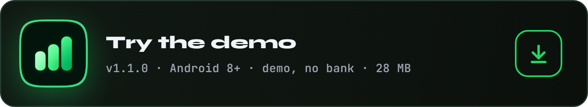

<div align="center">

<p>
  <a href="README.md"></a>
  
</p>


</div>

<br>

An Android budgeting app, made for one person and one account: their own. It reads the current account over PSD2, files every transaction under its category, sets aside what is neither spending nor income, and shows where the money goes, month after month. Everything stays on the phone, encrypted.

It came from a simple wish: stop spending without looking, and stop dipping into savings. The model is Bankin; the style is Spotify's, plain and dark, with a single green.

The app itself is in French; this page is its English description.


On the phone, a floating capsule at the bottom to get around.


On the Fold's unfolded screen, a rail on the left, and pages become panes side by side.


<p align="center">
<a href="https://github.com/Cybertrist/SmartBudget/releases/latest/download/SmartBudget.apk"></a>
<a href="https://github.com/Cybertrist/SmartBudget/releases/latest/download/SmartBudget-demo.apk"></a>
</p>

Two apps, which install side by side without getting in each other's way.

- **SmartBudget**, the full version: it links to your bank and holds only your real transactions.
- **SmartBudget démo**: four months of made-up transactions, already loaded when it opens, no bank, no fingerprint, and screenshots allowed. To see every screen before linking anything.

The APKs are not on the Play Store: Android asks, once, to allow installs from the browser. Every version is signed with the same key, so it installs over the previous one without losing anything. To check the downloaded file:

```
# SHA-256 of SmartBudget.apk, version 1.1.0
8ba46b6c6ddd59e2ca070cc10bb91a97952e8c8b4e038a531fa0c017fb501955

# SHA-256 of SmartBudget-demo.apk, version 1.1.0
fe4cf85184ed59b62302309c7b00a106e4fdee90e00a51cfa3b9c15d7d63874a

# SHA-256 of the signing certificate, CN=SmartBudget, O=Cybertrist
55572db26550312a39ee80315ad81ce6c31e492f0e3aebfc8e5e0f2cffabcbef
```

To build it yourself:

```
flutter build apk --release --split-per-abi
# the demo, with its own identifier and the demo data already loaded:
flutter build apk --release --split-per-abi --dart-define=DEMO=true
```


Banks do not talk to individuals: you need a PSD2-licensed aggregator. [Enable Banking](https://enablebanking.com) offers one, free in restricted mode, meaning limited to the accounts you linked yourself on its portal. Bridge, Bankin's API, is for businesses only, and GoCardless has closed sign-ups.

**Before you start**, you need: SmartBudget installed, an email address you can open on the phone, and whatever you use to sign in to your online banking (login, and the usual confirmation, Safetrans at Crédit Mutuel). It takes about ten minutes, once: after that, access lasts 180 days.


The app itself is in French: button names below are given as they appear on screen, with their meaning in brackets.

### 1. Choose the bank

**Réglages** (Settings) tab, **Ta banque** (Your bank) card, **Choisir la banque** (Choose the bank) button. The list holds every bank Enable Banking can read for individuals, in some thirty European countries: the major banks of the phone's country first, then all the others from A to Z.

### 2. Find yours

Type part of the name (`mutuel bretagne`) or a country (`belgique`) in the search field, then tap your bank. Each bank fits on one row, with its country: there is nothing to expand. Each one wears its mobile app's icon, bundled with SmartBudget: no image is loaded from the Internet, and banks without an app keep their initials.

Tapping the bank opens the **Obtenir ta clé** (Get your key) page straight away, which guides the next step.

### 3. Get your key on the Enable Banking portal

This is the only step outside the app. The **Obtenir ta clé** page lists the instructions in order, and every value to paste has its own **Copier** (Copy) button: you just go back and forth between SmartBudget and the browser.


1. **Sign in.** Tap **Ouvrir le portail** (Open the portal): the sign-in page opens in the browser. Type your email, **Continue**, then open the link you receive by email. The Enable Banking account creates itself the first time.
2. **Create the application.** In **API applications**, fill in **Add a new application**:
   - **Environment**: `Production`
   - **Private key**: leave `Generate in the browser`
   - **Application name**: `SmartBudget`
   - **Allowed redirect URLs**: `https://cybertrist.github.io/SmartBudget/` (Copy button)
   - **Application description**: the suggested sentence (Copy button)
   - **Email for data protection**: your own email address
   - **Privacy URL** and **Terms URL**: `https://github.com/Cybertrist/SmartBudget` (Copy buttons)
3. **Register.** The portal downloads a `.pem` file: this is the application's private key. **Never rename it**: its name is the application ID, and SmartBudget reads it to use the key.
4. **Link your account on the portal.** On the application's page, tap **Activate by linking accounts**, choose the country, your bank and the `personal` type, then **Link**. The bank's page opens: sign in and confirm as usual. The application switches to restricted mode, free, limited to that account.

### 4. Import the key

Back in SmartBudget, at the bottom of the **Obtenir ta clé** page: **Importer la clé** (Import the key), and pick the `.pem` file in Downloads. It is encrypted on the phone at once (AES-GCM, with a key derived from the Keystore), and the working copy is deleted. The file left in Downloads can then be deleted, or stored somewhere safe to import the key again one day.

### 5. Link the account

The rest follows on its own: the bank's page opens one last time, you confirm as usual, and SmartBudget takes over again. The **Ta banque** card then shows **Synchronisé** (Synced), with the days of access left, and the last twelve months arrive.

After that, there is nothing left to do: SmartBudget syncs **every time it opens**, and every time you come back to it, as soon as the last sync is more than ten minutes old. The card's **Synchroniser** (Sync) button starts one by hand. Transactions still pending at the bank, like today's card payment, show up at once, marked **En attente** (Pending), then are replaced by their final version.

### If something goes wrong

- **"Le nom du fichier ne contient pas l'identifiant de l'application"** (the file name does not contain the application ID): the `.pem` file was renamed, for instance to `cle.pem`. Download it again from the application's page, without touching its name.
- **"Ce fichier n'est pas une clé privée"** (this file is not a private key): the chosen file is not the portal's `.pem`. Pick the one downloaded in step 3.
- **"Enable Banking refuse la clé"** (Enable Banking rejects the key): the imported key does not match the application, or the application is not in `Production`. Redo step 3, then import the new key (the card's **Nouvelle clé**, New key, button).
- **"Pas de connexion à Internet."** (no Internet connection): the sync resumes on its own the next time the app opens with a network.
- **"Trop de synchronisations aujourd'hui"** (too many syncs today): the bank limits the number of accesses per day. Just wait until tomorrow.
- **"L'accès a expiré : reconnecte le compte."** (access expired, reconnect the account): the 180 days are up. Tap **Relier le compte** (Link the account) and confirm at the bank: the key stays the same, nothing else to redo.
- **Your bank is not in the list**: Enable Banking cannot read it yet, or not for individuals.

Access expires after 180 days, by law, or sooner if the bank grants less: the bank card warns fifteen days ahead, and one tap renews it. PSD2 only shares the current account, which the bank calls "CARTE BANCAIRE": savings accounts are entered by hand, then follow the transfers the app spots. The app was written and tested with Crédit Mutuel de Bretagne: elsewhere, categorisation works the same way, but transfers to savings accounts may need to be marked by hand the first time.

### What happens behind the scenes


Every request to Enable Banking carries a token signed with RS256 by the imported key, decrypted only for the duration of the call. The bank's redirect goes through a GitHub Pages page (`docs/index.html`), which hands back to the app through the `smartbudget://banque` link; the state token, drawn at random at the start and checked on return, stops a link forged elsewhere from linking another account.

**The overdrawn alert** is the app's only notification. Every six hours, even with the app closed, it reads the current account's balance again, and nothing else: four reads a day at most, the limit PSD2 grants to access made without you. If it drops below zero, a notification gives the amount; the next one waits until the account has gone back up and down again.




A bank label is written for the bank. The merchant is pulled out of it by removing prefixes, the masked card, dates, references and copied amounts; its key, its first three words without company suffixes, stays the same from one month to the next. That key carries corrections, chosen names and repetitions: renaming "Spotify P2f9 Stockholm" to "Spotify" renames all its transactions, the upcoming ones included.

What nothing recognises lands in "À classer" (uncategorised) and waits in **À vérifier** (to review), flagged on the home screen. A checked transaction gets ticked off, with a green tick.


An honest budget never counts the same money twice.

- **A transfer between your own accounts** is neither spending nor income. At Crédit Mutuel de Bretagne it reads `VIR VERS <destination> DE <source>`: the direction is in the label. It leaves the budget, hatched, and feeds "put aside" or "dipped into". If detection gets it wrong, either way, the **Mouvement** (movement) row of a transaction fixes it.
- **A refund** is linked to the expenses it pays back, from either side. They then only count for what is left to pay, and the refund does not count as income.
- **A cash expense** is entered by hand. It comes off the month's withdrawals, and the **wallet**, if opened, tracks what is left in your pocket.


A phone screen stretched over eight inches no longer looks like anything. On the open Fold, pages form one wide page showing its last two panes: you go down from the analysis to a single transaction without ever losing where you came from, and Samsung's back gesture closes the last pane. Each column tightens when needed to show everything at once, without scrolling. Inputs open in a card above the keyboard, never in a sheet sliding up from the bottom.


Amounts are integers, in cents: a float never touches money. The domain knows neither Flutter nor the database, which makes it testable without a device.


The master key is drawn at random on first launch and never leaves the Android Keystore. Everything else derives from it: the database, and the Enable Banking private key, the most sensitive data in the app, since it opens read access to the account. That key lives encrypted twice, under its own key and inside a database that is itself encrypted, and is only decrypted for the length of a request. The RS256 signature happens in Dart, through pointycastle, and matches OpenSSL's byte for byte.

**One exception, owned up to: the balance watch.** Reading the balance with the app closed takes the bank key, and so the master key. Every six hours, it is loaded without the fingerprint, for a single read, then forgotten. Android itself never tied the key to the fingerprint, only the app did; the watch makes that limit visible instead of hiding it.

**Tout effacer** (Erase everything) destroys the key first, then the database and its side files: even if interrupted, nothing readable is left.


SQLCipher and the Keystore only exist on a device: the tests run on an emulator, never on the phone holding the real accounts, since they erase the database.

```
flutter test integration_test -d emulator-5554
```


The code is released under the [MIT](LICENSE) licence: free to read, reuse and modify, as long as the copyright notice stays. The Figtree font is under the SIL Open Font licence, the Material Symbols icons under Apache 2.0.

Designed and written by **Tristan Joncour**, a cyber-defence engineering student at ENSIBS, for personal use. The security core, fingerprint, keychain and encryption, comes from another app by the same author, [BodyCount](https://github.com/Cybertrist/BodyCount).

**What will never be in this repository:** the Enable Banking private key, the APK signing key, and any real bank data at all. `.gitignore` refuses `.pem`, `.p12`, `.jks` and `key.properties` files.

<br>

<sub>The images on this page come out of no drawing software: they are HTML pages captured by Chrome, and eight animated SVGs written by hand by <code>anime.js</code>, in French and then in English through <code>anglais.json</code>. The screenshots come from an emulator filled with demo data, cropped by <code>rogner.js</code>. It is all in <a href="docs/tools/">docs/tools</a>.</sub>
