<div align="center">

<p>
  <a href="README.md"></a>
  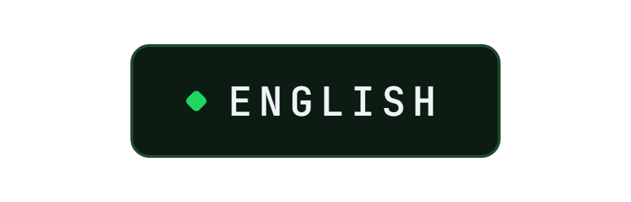
</p>

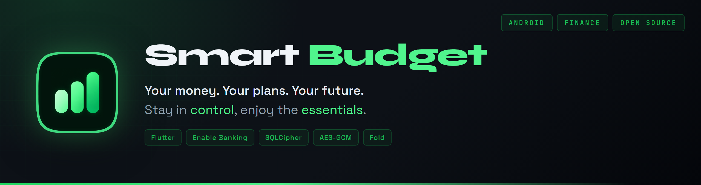

</div>

<br>

An Android budgeting app, made for one person and one account: their own. It reads the current account over PSD2, files every transaction under its category, sets aside what is neither spending nor income, and shows where the money goes, month after month. Everything stays on the phone, encrypted.

It came from a simple wish: stop spending without looking, and stop dipping into savings. The model is Bankin; the style is Spotify's, plain and dark, with a single green.

The app itself is in French; this page is its English description.

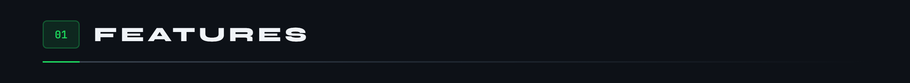


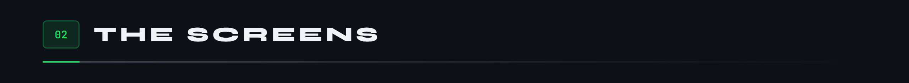

On the phone, a floating capsule at the bottom to get around.


On the Fold's unfolded screen, a rail on the left, and pages become panes side by side.

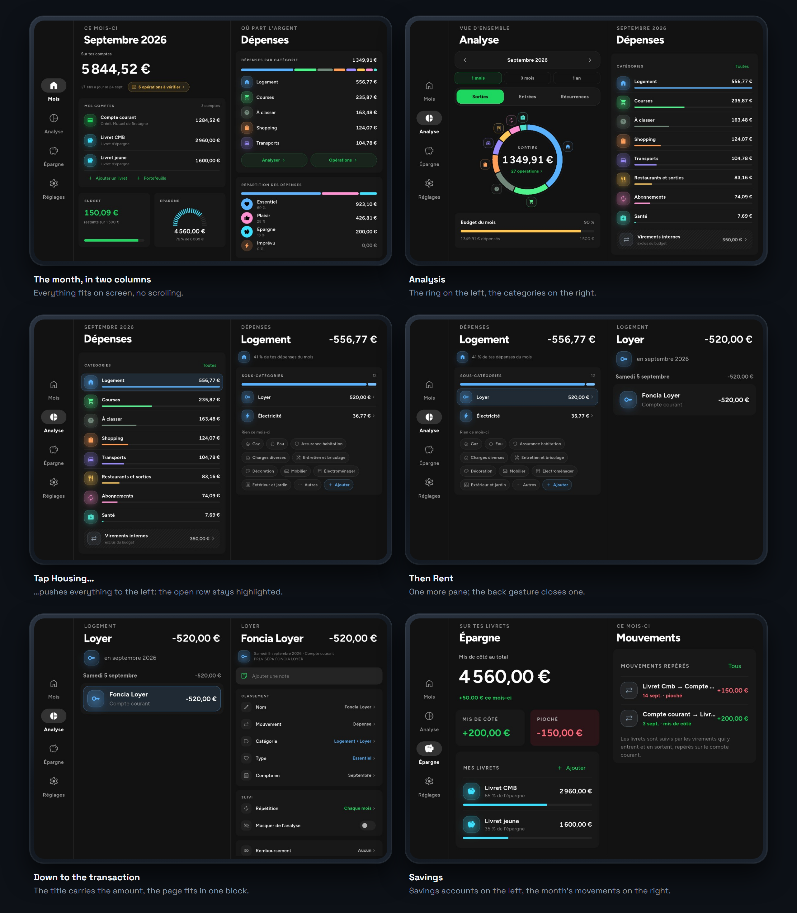

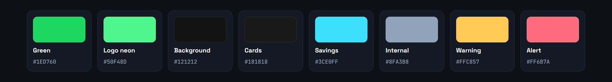

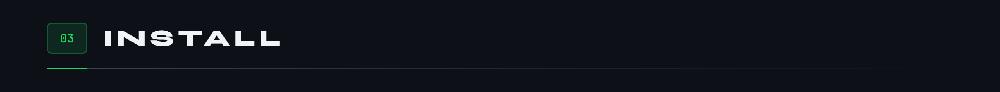

<p align="center">
<a href="https://github.com/Cybertrist/SmartBudget/releases/latest/download/SmartBudget.apk">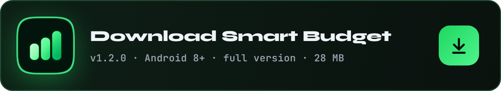</a>
</p>

The APK is not on the Play Store: Android asks, once, to allow installs from the browser. Every version is signed with the same key, so it installs over the previous one without losing anything. To check the downloaded file:

```
# SHA-256 of SmartBudget.apk, version 1.0.0
d73996a9305b03bb00a4ee9235b5087cc661a458f51f4d7c411464b9c5fedfea

# SHA-256 of the signing certificate, CN=SmartBudget, O=Cybertrist
55572db26550312a39ee80315ad81ce6c31e492f0e3aebfc8e5e0f2cffabcbef
```

To build it yourself:

```
flutter build apk --release --split-per-abi
# with four months of demo data, to try it without a bank:
flutter build apk --release --split-per-abi --dart-define=ESSAIS=true
```

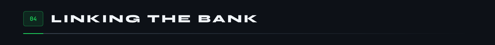


Banks do not talk to individuals: you need a PSD2-licensed aggregator. [Enable Banking](https://enablebanking.com) offers one, free in restricted mode, meaning limited to the accounts you linked yourself on its portal. Bridge, Bankin's API, is for businesses only, and GoCardless has closed sign-ups.

1. On the Enable Banking portal, create a production application in restricted mode, with `https://cybertrist.github.io/SmartBudget/` as the redirect URL, then link your bank account to it. The app is built around Crédit Mutuel de Bretagne, whose labels it knows how to read.
2. Download the private key: a `.pem` file named after the application ID. Never rename it.
3. In the app, Réglages (Settings), **Importer la clé** (Import the key), pick the file. It is encrypted at once and the copy is erased.
4. **Relier le compte** (Link the account): the bank's page opens, you approve with Safetrans, and the app takes over again.

Access expires after 180 days, by law: the bank card warns fifteen days ahead, and one tap renews it. PSD2 only shares the current account, which the bank calls "CARTE BANCAIRE": savings accounts are entered by hand, then follow the transfers the app spots.

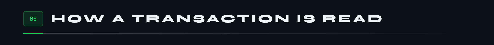


A bank label is written for the bank. The merchant is pulled out of it by removing prefixes, the masked card, dates, references and copied amounts; its key, its first three words without company suffixes, stays the same from one month to the next. That key carries corrections, chosen names and repetitions: renaming "Spotify P2f9 Stockholm" to "Spotify" renames all its transactions, the upcoming ones included.

What nothing recognises lands in "À classer" (uncategorised) and waits in **À vérifier** (to review), flagged on the home screen. A checked transaction gets ticked off, with a green tick.

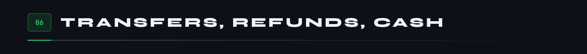


An honest budget never counts the same money twice.

- **A transfer between your own accounts** is neither spending nor income. At Crédit Mutuel de Bretagne it reads `VIR VERS <destination> DE <source>`: the direction is in the label. It leaves the budget, hatched, and feeds "put aside" or "dipped into". If detection gets it wrong, either way, the **Mouvement** (movement) row of a transaction fixes it.
- **A refund** is linked to the expenses it pays back, from either side. They then only count for what is left to pay, and the refund does not count as income.
- **A cash expense** is entered by hand. It comes off the month's withdrawals, and the **wallet**, if opened, tracks what is left in your pocket.

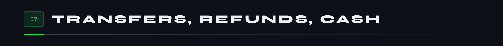


A phone screen stretched over eight inches no longer looks like anything. On the open Fold, pages form one wide page showing its last two panes: you go down from the analysis to a single transaction without ever losing where you came from, and Samsung's back gesture closes the last pane. Each column tightens when needed to show everything at once, without scrolling. Inputs open in a card above the keyboard, never in a sheet sliding up from the bottom.


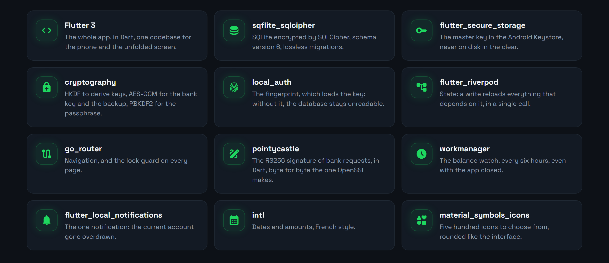

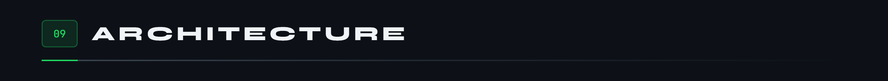

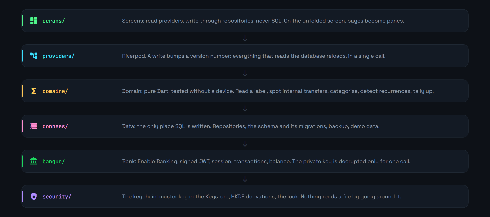


Amounts are integers, in cents: a float never touches money. The domain knows neither Flutter nor the database, which makes it testable without a device.



The master key is drawn at random on first launch and never leaves the Android Keystore. Everything else derives from it: the database, and the Enable Banking private key, the most sensitive data in the app, since it opens read access to the account. That key lives encrypted twice, under its own key and inside a database that is itself encrypted, and is only decrypted for the length of a request. The RS256 signature happens on the native side, through `java.security`.

**Tout effacer** (Erase everything) destroys the key first, then the database and its side files: even if interrupted, nothing readable is left.

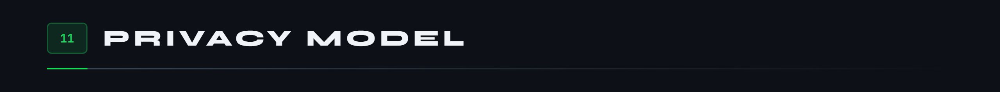

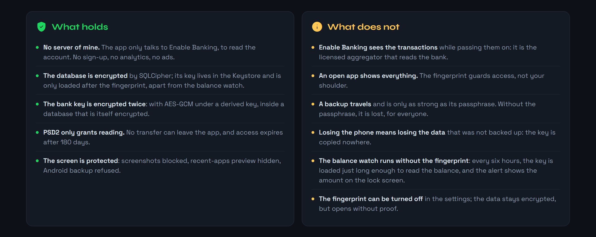

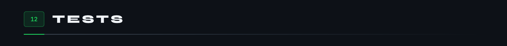

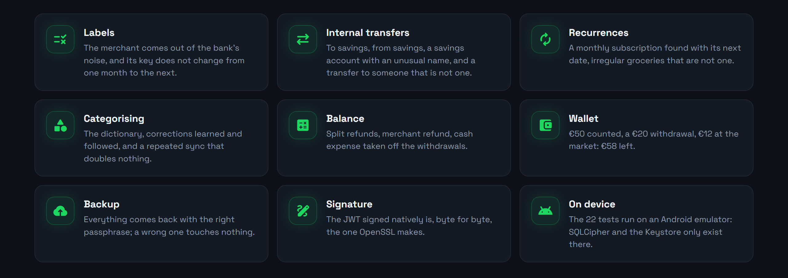

SQLCipher and the Keystore only exist on a device: the tests run on an emulator, never on the phone holding the real accounts, since they erase the database.

```
flutter test integration_test -d emulator-5554
```

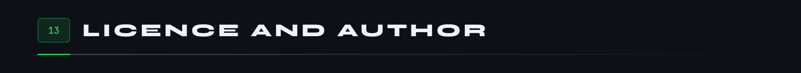

The code is released under the [MIT](LICENSE) licence: free to read, reuse and modify, as long as the copyright notice stays. The Figtree font is under the SIL Open Font licence, the Material Symbols icons under Apache 2.0.

Designed and written by **Tristan Joncour**, a cyber-defence engineering student at ENSIBS, for personal use. The security core, fingerprint, keychain and encryption, comes from another app by the same author, [BodyCount](https://github.com/Cybertrist/BodyCount).

**What will never be in this repository:** the Enable Banking private key, the APK signing key, and any real bank data at all. `.gitignore` refuses `.pem`, `.p12`, `.jks` and `key.properties` files.

<br>

<sub>The images on this page come out of no drawing software: they are HTML pages captured by Chrome, and five animated SVGs written by hand by <code>anime.js</code>, in French and then in English through <code>anglais.json</code>. The screenshots come from an emulator filled with demo data, cropped by <code>rogner.js</code>. It is all in <a href="docs/tools/">docs/tools</a>.</sub>
