<div align="center">

<p>
  <a href="README.md"></a>
  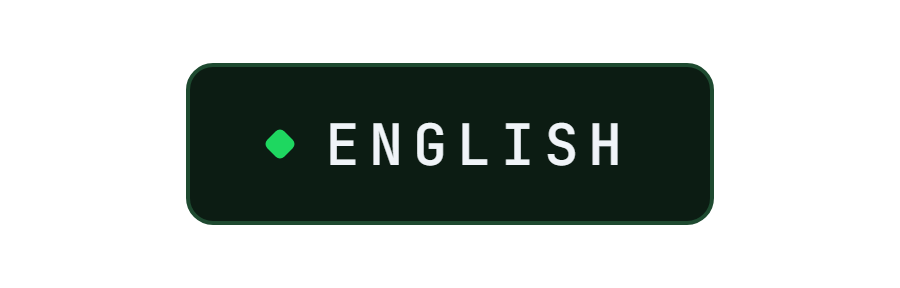
</p>

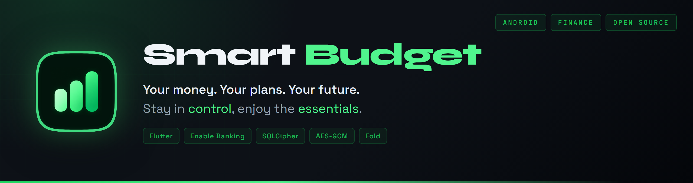

<br>

**An Android budgeting app, made for one person and one account: their own.**

</div>

It reads the current account over PSD2, files every transaction under its category, sets aside what is neither spending nor income, and shows where the money goes, month after month. Everything stays on the phone, encrypted: no server, no account to create, no advertising.

It came from a simple wish: stop spending without looking, and stop dipping into savings. The model is Bankin; the style is Spotify's, plain and dark, with a single green. The app itself is in French; this page is its English description, and button names are given as they appear on screen, with their meaning in brackets.

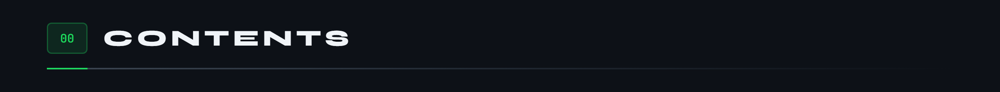

<p align="center">
<a href="#fonctionnalites"></a>
<a href="#ecrans">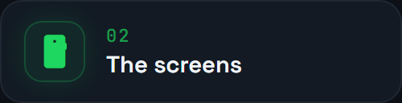</a>
<a href="#installer">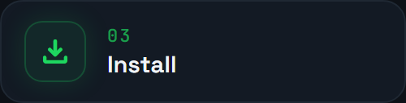</a>
<br>
<a href="#relier"></a>
<a href="#quotidien">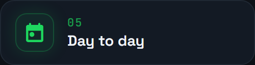</a>
<a href="#lecture">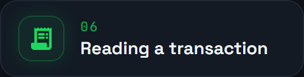</a>
<br>
<a href="#mouvements">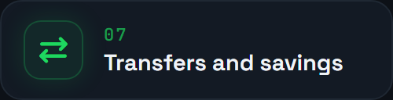</a>
<a href="#alerte"></a>
<a href="#deplie">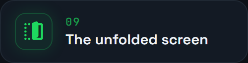</a>
<br>
<a href="#chiffrement"></a>
<a href="#confidentialite">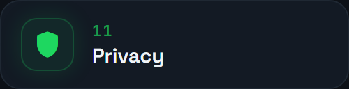</a>
<a href="#architecture">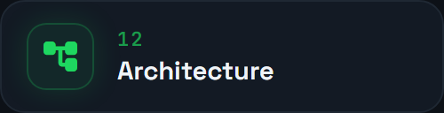</a>
<br>
<a href="#tests"></a>
<a href="#versions"></a>
<a href="#licence"></a>
</p>

<a id="fonctionnalites"></a>
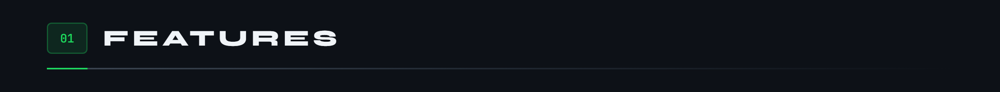


<a id="ecrans"></a>
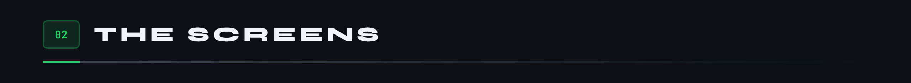

On the phone, a floating capsule at the bottom to get around. Every screenshot comes from the demo data.


On the Fold's unfolded screen, a rail on the left, and pages become panes side by side.

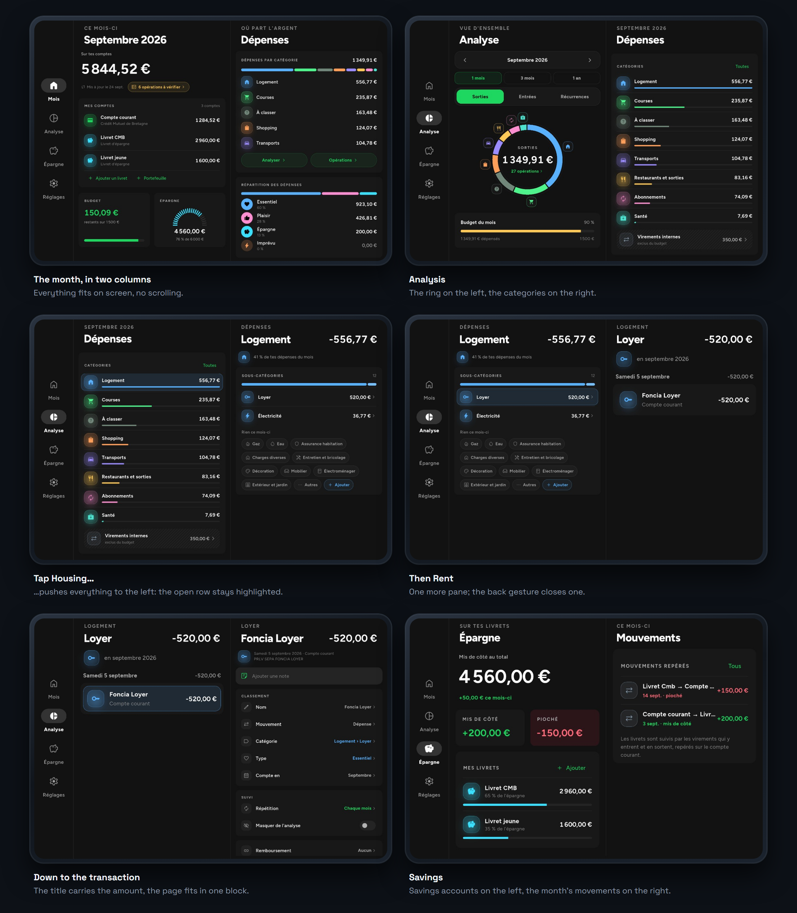

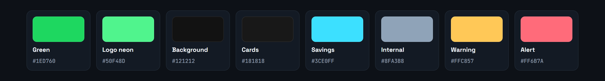

<a id="installer"></a>
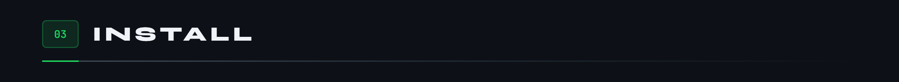

<p align="center">
<a href="https://github.com/Cybertrist/SmartBudget/releases/latest/download/SmartBudget.apk">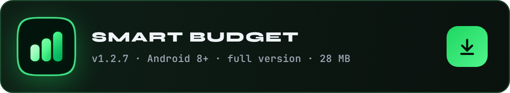</a>
<a href="https://github.com/Cybertrist/SmartBudget/releases/latest/download/SmartBudget-demo.apk">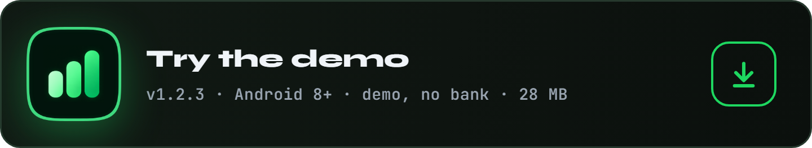</a>
</p>

Two apps, which install side by side without getting in each other's way.

- **SmartBudget**, the full version: it links to your bank and holds only your real transactions.
- **SmartBudget démo**: four months of made-up transactions, already loaded when it opens, no bank, no fingerprint, and screenshots allowed. To see every screen before linking anything.

The APKs are not on the Play Store: Android asks, once, to allow installs from the browser. Every version is signed with the same key: it installs over the previous one without losing anything.

<details>
<summary><b>Check the downloaded file, or build it yourself</b></summary>

```
# SHA-256 of SmartBudget.apk, version 1.2.6
0b8ba947f2d5a8d697713ee7b3f50cd0497112cc34e05d5f87a1f0b0a4cbb850

# SHA-256 of SmartBudget-demo.apk, version 1.2.6
67a1c7100131d4d9ec81fad7ba9594c92c1c26a093e4c7230cf6cdd23562ad5a

# SHA-256 of the signing certificate, CN=SmartBudget, O=Cybertrist
55572db26550312a39ee80315ad81ce6c31e492f0e3aebfc8e5e0f2cffabcbef
```

```
flutter build apk --release --split-per-abi
# the demo, with its own identifier and the demo data already loaded:
flutter build apk --release --split-per-abi --dart-define=DEMO=true
```

</details>

<a id="relier"></a>
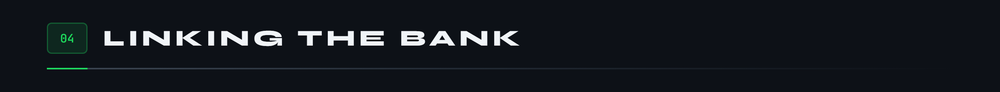

Banks do not talk to individuals: you need a PSD2-licensed aggregator. [Enable Banking](https://enablebanking.com) offers one, free in restricted mode, meaning limited to the accounts you linked yourself on its portal.

**You need** SmartBudget installed, an email address you can open on the phone, and whatever you use to sign in to your online banking. It takes about ten minutes, once: after that, access lasts 180 days.


### 1. Choose the bank

**Réglages** (Settings) tab, **Ta banque** (Your bank) card, **Choisir la banque** (Choose the bank) button. The list holds every bank Enable Banking can read for individuals, in some thirty European countries: the major banks of the phone's country first, then all the others from A to Z.

### 2. Find yours

Type part of the name (`mutuel bretagne`) or a country (`belgique`), then tap your bank. Each bank fits on one row, with its country and its mobile app's icon, bundled with SmartBudget: no image is loaded from the Internet. The **Obtenir ta clé** (Get your key) page opens straight away.

### 3. Get your key on the Enable Banking portal

This is the only step outside the app. The **Obtenir ta clé** page lists the instructions in order, and every value to paste has its own **Copier** (Copy) button: you just go back and forth between SmartBudget and the browser.


1. **Sign in.** Tap **Ouvrir le portail** (Open the portal), type your email, **Continue**, then open the link you receive. The Enable Banking account creates itself the first time.
2. **Create the application.** In **API applications**, fill in **Add a new application**:
   - **Environment**: `Production`
   - **Private key**: leave `Generate in the browser`
   - **Application name**: `SmartBudget`
   - **Allowed redirect URLs**: `https://cybertrist.github.io/SmartBudget/` (Copy button)
   - **Application description**: the suggested sentence (Copy button)
   - **Email for data protection**: your own email address
   - **Privacy URL** and **Terms URL**: `https://github.com/Cybertrist/SmartBudget` (Copy buttons)
3. **Register.** The portal downloads a `.pem` file: the application's private key. **Never rename it**: its name is the application ID.
4. **Link your account on the portal.** On the application's page, **Activate by linking accounts**, choose the country, your bank and the `personal` type, then **Link**, and confirm on the bank's page as usual.

### 4. Import the key

Back in SmartBudget, at the bottom of the **Obtenir ta clé** page: **Importer la clé** (Import the key), and pick the `.pem` file in Downloads. It is encrypted on the phone at once (AES-GCM, with a key derived from the Keystore), and its working copy deleted.

### 5. Link the account

The bank's page opens one last time, you confirm, and SmartBudget takes over. The **Ta banque** card shows **Synchronisé** (Synced), with the days of access left, and the last twelve months arrive. After that, there is nothing left to do.

Access expires after 180 days, by law: with less than fifteen days left, the bank card turns yellow, and once access has expired, **Relier le compte** (link the account) renews it, with the same key. PSD2 only shares the current account, which the bank calls "CARTE BANCAIRE": savings accounts are entered by hand, then follow the transfers the app spots. The app was written and tested with Crédit Mutuel de Bretagne; elsewhere, categorisation works the same way, but transfers to savings accounts may need marking by hand the first time.

<details>
<summary><b>If something goes wrong</b></summary>

- **"Le nom du fichier ne contient pas l'identifiant de l'application"** (the file name does not contain the application ID): the `.pem` file was renamed, for instance to `cle.pem`. Download it again from the application's page, without touching its name.
- **"Ce fichier n'est pas une clé privée"** (this file is not a private key): the chosen file is not the portal's `.pem`. Pick the one downloaded in step 3.
- **"Enable Banking refuse la clé"** (Enable Banking rejects the key): the imported key does not match the application, or the application is not in `Production`. Redo step 3, then import the new key (the card's **Nouvelle clé**, New key, button).
- **"Pas de connexion à Internet."** (no Internet connection): the sync resumes on its own the next time the app opens with a network.
- **"Trop de synchronisations aujourd'hui"** (too many syncs today): the bank limits the number of accesses per day. Just wait until tomorrow.
- **"L'accès a expiré : reconnecte le compte."** (access expired, reconnect the account): the 180 days are up. Tap **Relier le compte** (Link the account) and confirm at the bank: the key stays the same.
- **Your bank is not in the list**: Enable Banking cannot read it yet, or not for individuals.

</details>

<details>
<summary><b>What happens behind the scenes</b></summary>


Every request to Enable Banking carries a token signed with RS256 by the imported key, decrypted only for the length of the call. The bank's redirect goes through a GitHub Pages page (`docs/index.html`), which hands back to the app through the `smartbudget://banque` link; the state token, drawn at random at the start and checked on return, stops a link forged elsewhere from linking another account.

</details>

<a id="quotidien"></a>
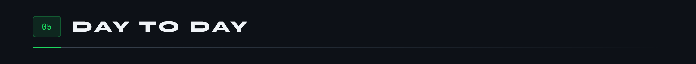

SmartBudget syncs **every time it opens**, and every time you come back to it as soon as the last sync is more than ten minutes old. There is nothing else to do but look.


Each sync asks again for the transactions since the last one, minus seven days, to catch those the bank books late. A transaction already known by its bank identifier is skipped: running it again doubles nothing. A **En attente** (pending) transaction, like today's card payment, shows up at once; once booked, it is updated in place and keeps what you did to it by hand (name, category, note, month) and its refund links.


The home screen always shows the current month. The budget is what is left once spending is taken out: green, yellow from 90%, red beyond, where it shows the overrun. Then come the five heaviest categories, and the split between essential, treat, savings and unexpected. A transfer to a savings account only counts as savings, a linked refund lightens the expense it pays back, and a hidden transaction appears nowhere.


The analysis starts from a month and goes down to the transaction. The arrows change the month, the chips pick one month, three or a year, and the tabs switch between spending, income and recurrences. The centre of the ring opens the transactions it counts; a category opens its subcategories, a subcategory its transactions, day by day. Coming back, the month, the period and the tab stay as chosen.

<a id="lecture"></a>
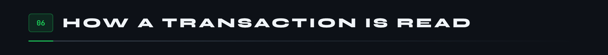



A bank label is written for the bank. The merchant is pulled out of it by removing prefixes, the masked card, dates, references and copied amounts; its key, its first three words without company suffixes, stays the same from one month to the next. That key carries corrections, chosen names and repetitions: renaming "Spotify P2f9 Stockholm" to "Spotify" renames all its transactions, the upcoming ones included.


What nothing recognises waits in **À vérifier** (to review), flagged on the home screen. Categorising a transaction writes a rule on the merchant key: its other transactions not sorted by hand follow at once, and the next ones arrive already sorted. A cheque, a cheque deposit or a withdrawal has no merchant: categorising one only applies to it. Categorising or keeping ticks the transaction off, with a green tick.


Recurring payments are worked out on their own: at least two payments from one merchant, an amount within 15%, and every gap inside a window (a week, a month, a quarter, a year). The next date follows, and the analysis files them as late (four days of grace), upcoming or paid. A transaction's **Répétition** (repetition) line overrides detection for the whole merchant: "Aucune" (none) if it does not come back, a frequency if it comes back with no rhythm.

<a id="mouvements"></a>
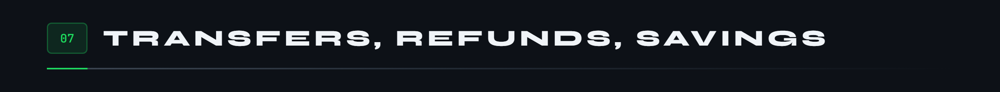


An honest budget never counts the same money twice.

- **A transfer between your own accounts** is neither spending nor income. At Crédit Mutuel de Bretagne it reads `VIR VERS <destination> DE <source>`: the direction is in the label. It leaves the budget, hatched, and feeds "put aside" or "dipped into". If detection gets it wrong, the **Mouvement** (movement) row of a transaction fixes it.
- **A refund** is linked to the expenses it pays back. They then only count for what is left to pay, and the refund does not count as income.
- **A cash expense** is entered by hand. It draws on the oldest withdrawal before it, up to two months back: taking out €50 in September then paying €20 at the market in October counts €30 of withdrawal in September and €20 of groceries in October, never 70. The **wallet**, if opened, tracks what is left in your pocket.


The refund can arrive before the purchase or after it. From the expense, its **Remboursement** (refund) line opens **Associer à un remboursement** (link to a refund), which offers money received up to two months before or after, with what is left of it. From the income, **Lier des dépenses** (link expenses) splits it over several expenses, and the **Réparti** (split) gauge never goes past the amount received. An expense can be paid back by several incomes, never beyond its amount. Each transaction stays in its month: an August purchase paid back in September corrects August.


Each savings account is added once, in **Épargne** (savings), **Mes livrets** (my savings), **Ajouter** (add): its current balance, its type, and the word that names it on the statement. From then on, each transfer to or from it, spotted on the current account, moves its balance, as long as it comes after the balance was entered and is no longer pending. Tapping an account corrects its balance, as the bank shows it.


**The budget month** opens with the salary: each salary opens its month on the day it arrives, even when paid early. The salary of 19 December, paid early for Christmas, opens January that day, and December never counts two salaries. In the settings, *Début du mois* (month start) shows the usual payday, for instance “Salaire, vers le 25” (salary, around the 25th): SmartBudget finds it on its own, the middle day of your salaries over the last six months, and it only serves months whose salary has not arrived yet. You can also pick it by hand, from the 1st to the 28th.

Only a real salary opens a month: filed under Salary, at least half the usual salary, and within ten days of the usual payday. A bonus or a refund opens nothing, and two salaries for the same month open it only once. If a transaction still lands on the wrong side, rent paid for the next month for instance, the transaction's **Compte en** (counts in) row attaches it to the month before or after.

<a id="alerte"></a>
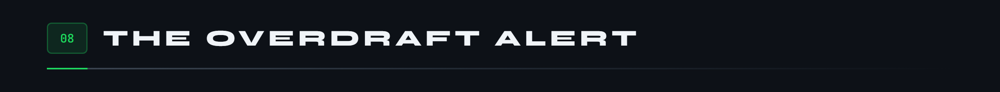

SmartBudget sends only one notification: **"Compte courant en négatif"** (current account overdrawn), with the amount, when the account has just gone below zero. No budget reminder, no weekly summary, no advertising: nothing else ever rings.



- **One alert per drop below zero.** As long as the account stays overdrawn, the following reads stay quiet; as soon as it recovers, the alert re-arms.
- **Every six hours, even with the app closed**, Android wakes a small background task, only when there is a network. It reads **the balance, and nothing else**, four times a day at most, the limit PSD2 grants to access made without you. Every sync inside the app runs the same comparison.
- **The amount shows on the lock screen**: on purpose, the alert must be seen without unlocking. Tapping it opens SmartBudget, behind the fingerprint.

**The price of the alert.** To read the balance, the background task needs the bank key, and so the master key: it is loaded without fingerprint, for that read only, then forgotten. This is the only exception to the "nothing opens without the fingerprint" rule, and the privacy model lists it among what is not protected.

<details>
<summary><b>Turning it on, silencing it, stopping it</b></summary>

- **Turning it on**: nothing to do. As soon as the account is linked, the watch starts, and Android 13 or later asks once for permission to send notifications. Answer **Allow**.
- **Silencing it**: Android Settings, Apps, Smart Budget, Notifications, then turn off the **"Compte en négatif"** (account overdrawn) category. The watch keeps reading the balance, but no longer rings.
- **Stopping it entirely**: **Délier** (Unlink) the bank in SmartBudget's settings. No more reads happen in the background.
- **The demo** has no bank, so no watch and no notification.

</details>

<a id="deplie"></a>
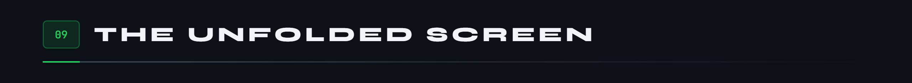


A phone screen stretched over eight inches no longer looks like anything. On the open Fold, pages form one wide page showing its last two panes: you go down from the analysis to a single transaction without ever losing where you came from, and Samsung's back gesture closes the last pane. Every page fits at once, without scrolling; a transaction opened on its own switches to two columns. Inputs open in a card above the keyboard, never in a sheet sliding up from the bottom.

<a id="chiffrement"></a>
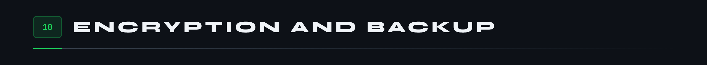


The master key is drawn at random on first launch and never leaves the Android Keystore. Everything else derives from it: the database, and the Enable Banking private key, the most sensitive data in the app, since it opens read access to the account. That key lives encrypted twice, under its own key and inside a database that is itself encrypted, and is only decrypted for the length of a request. The RS256 signature is made in Dart, by pointycastle, byte for byte the same as OpenSSL's. **Tout effacer** (erase everything) destroys the key first, then the database: even if interrupted, nothing readable is left.


Settings, Backup, **Exporter, chiffré** (export, encrypted): the passphrase is typed twice, so a typo never locks the file. The file can travel anywhere: without the passphrase it is unreadable. On another phone, **Restaurer une sauvegarde** (restore a backup) replaces everything in a single transaction; a wrong passphrase touches nothing. The bank key, encrypted by the old phone's master key, cannot be read there: it is dropped, and importing it again relinks the account.

<a id="confidentialite"></a>
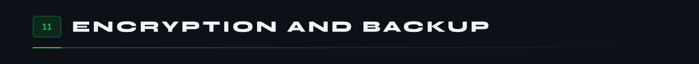


<a id="architecture"></a>


Amounts are integers, in cents: a float never touches money. The domain knows neither Flutter nor the database, which makes it testable without a device.

<a id="tests"></a>


SQLCipher and the Keystore only exist on a device: the integration tests run on an emulator, never on the phone holding the real accounts, since they erase the database.

```
flutter test                                   # the pure logic
flutter test integration_test -d emulator-5554 # the encrypted database, on an emulator
```

<a id="versions"></a>


Every Release, with its notes and SHA-256 fingerprints: [github.com/Cybertrist/SmartBudget/releases](https://github.com/Cybertrist/SmartBudget/releases).

<a id="licence"></a>
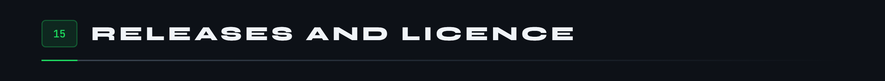

The code is released under the [MIT](LICENSE) licence: free to read, reuse and modify, as long as the copyright notice stays. The Figtree font is under the SIL Open Font licence, the Material Symbols icons under Apache 2.0.

Designed and written by **Tristan Joncour**, a cyber-defence engineering student at ENSIBS, for personal use. The security core, fingerprint, keychain and encryption, comes from another app by the same author, [BodyCount](https://github.com/Cybertrist/BodyCount).

**What will never be in this repository:** the Enable Banking private key, the APK signing key, and any real bank data at all. `.gitignore` refuses `.pem`, `.p12`, `.jks` and `key.properties` files.

<br>

<sub>The images on this page come out of no drawing software: they are HTML pages captured by Chrome, and twenty-three animated SVGs written by <code>anime.js</code> and the modules in <code>schemas/</code>, in French and then in English through <code>anglais.json</code>. The screenshots come from an emulator filled with demo data, cropped by <code>rogner.js</code>. It is all in <a href="docs/tools/">docs/tools</a>.</sub>
