<div align="center">

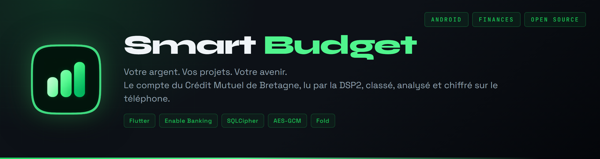

</div>

<br>

Une application Android de budget, faite pour une seule personne et un seul compte : le sien. Elle lit le compte courant au Crédit Mutuel de Bretagne par la DSP2, range chaque opération dans sa catégorie, met de côté ce qui n'est ni une dépense ni un revenu, et montre où part l'argent, mois après mois. Tout reste sur le téléphone, chiffré.

Elle est née d'une envie simple : arrêter de dépenser sans regarder, et de piocher dans l'épargne. Le modèle, c'est Bankin ; le style, celui de Spotify, sobre et sombre, avec un seul vert.

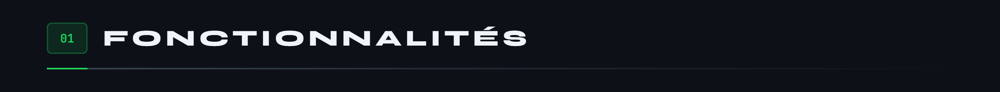


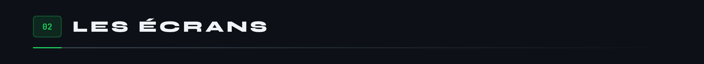

Sur le téléphone, une capsule flottante en bas pour naviguer.


Sur l'écran déplié du Fold, un rail à gauche, et les pages deviennent des volets côte à côte.

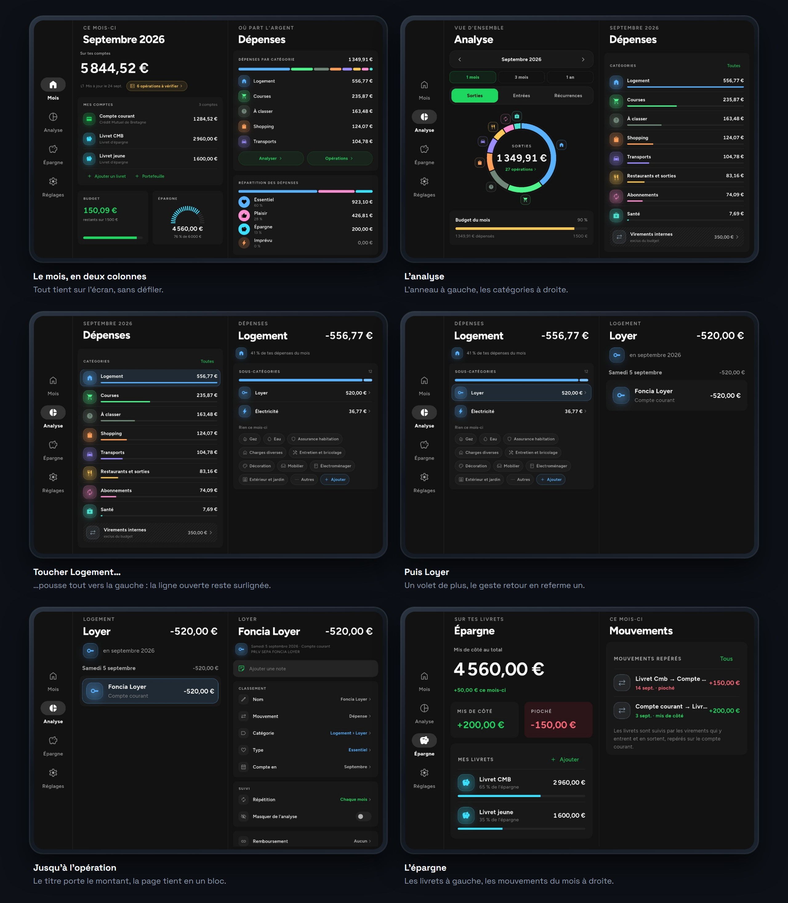

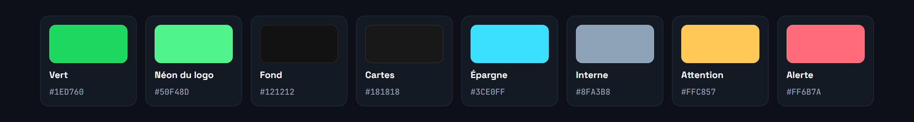

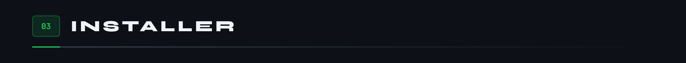

<p align="center">
<a href="https://github.com/Cybertrist/SmartBudget/releases/latest/download/SmartBudget.apk">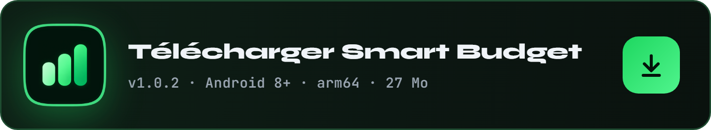</a>
</p>

L'APK n'est pas sur le Play Store : Android demande d'autoriser l'installation depuis le navigateur, une fois. Chaque version est signée par la même clé, ce qui permet de l'installer par-dessus la précédente sans rien perdre. Pour vérifier le fichier téléchargé :

```
# SHA-256 de SmartBudget.apk, version 1.0.0
d73996a9305b03bb00a4ee9235b5087cc661a458f51f4d7c411464b9c5fedfea

# SHA-256 du certificat de signature, CN=SmartBudget, O=Cybertrist
55572db26550312a39ee80315ad81ce6c31e492f0e3aebfc8e5e0f2cffabcbef
```

Pour la construire soi-même :

```
flutter build apk --release --split-per-abi
# avec le jeu d'essai de quatre mois, pour essayer sans banque :
flutter build apk --release --split-per-abi --dart-define=ESSAIS=true
```

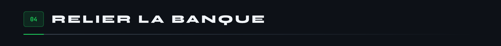


La banque ne parle pas aux particuliers : il faut un agrégateur agréé DSP2. [Enable Banking](https://enablebanking.com) en propose un, gratuit en mode restreint, c'est-à-dire limité aux comptes qu'on a soi-même reliés sur son portail. Bridge, l'API de Bankin, est réservé aux entreprises, et GoCardless a fermé ses inscriptions.

1. Sur le portail d’Enable Banking, créer une application en production, mode restreint, avec pour adresse de retour `https://cybertrist.github.io/SmartBudget/`, puis y relier son compte au Crédit Mutuel de Bretagne.
2. Télécharger la clé privée : un fichier `.pem` dont le nom est l'identifiant de l'application. Ne jamais le renommer.
3. Dans l'application, Réglages, **Importer la clé**, choisir le fichier. Il est aussitôt chiffré et sa copie effacée.
4. **Relier le compte** : la page de la banque s'ouvre, on valide par Safetrans, et l'application reprend la main.

L'accès expire au bout de 180 jours, par la loi : la carte de la banque prévient quinze jours avant, et un toucher le renouvelle. La DSP2 ne partage que le compte courant, que la banque appelle « CARTE BANCAIRE » : les livrets se saisissent à la main, puis vivent au fil des virements repérés.

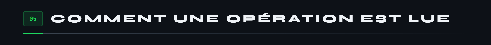


Un libellé de banque est écrit pour la banque. Le marchand s'en extrait en retirant les préfixes, la carte masquée, les dates, les références et les montants recopiés ; sa clé, ses trois premiers mots sans les suffixes de société, reste la même d'un mois à l'autre. C'est elle qui porte les corrections, les noms choisis et les répétitions : renommer « Spotify P2f9 Stockholm » en « Spotify » renomme toutes ses opérations, y compris les prochaines.

Ce que rien ne reconnaît tombe dans « À classer » et attend dans **À vérifier**, signalé sur l'accueil. Une opération vérifiée se pointe, et porte une coche verte.

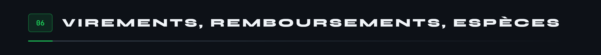


Un budget honnête ne compte pas deux fois le même argent.

- **Un virement entre ses comptes** n'est ni une dépense ni un revenu. Au Crédit Mutuel de Bretagne, il s'écrit `VIR VERS <destination> DE <source>` : le sens se lit dans le libellé. Il sort du budget, hachuré, et nourrit « mis de côté » ou « pioché ». Si la détection se trompe, dans un sens ou dans l'autre, la ligne **Mouvement** d'une opération la corrige.
- **Un remboursement** se lie aux dépenses qu'il rembourse, depuis l'une ou depuis l'autre. Elles ne comptent plus que pour leur reste à charge, et lui ne compte pas comme un revenu.
- **Une dépense en espèces** se saisit à la main. Elle se retranche des retraits du mois, et le **portefeuille**, s'il est ouvert, suit ce qui reste en poche.

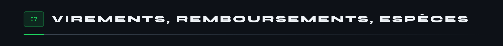


Un écran de téléphone étiré sur huit pouces ne ressemble plus à rien. Sur le Fold ouvert, les pages forment une seule grande page dont on voit les deux derniers volets : on descend de l'analyse à l'opération sans jamais perdre d'où l'on vient, et le geste retour de Samsung referme le dernier volet. Chaque colonne se resserre au besoin pour tout montrer d'un coup, sans défiler. Les saisies s'ouvrent dans une carte au-dessus du clavier, jamais dans une feuille qui monte du bas.

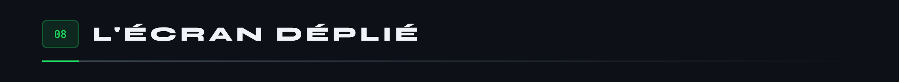

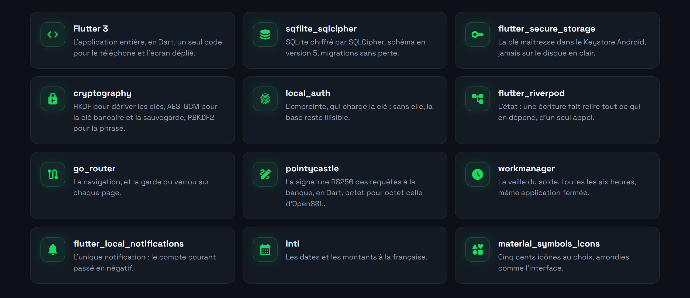


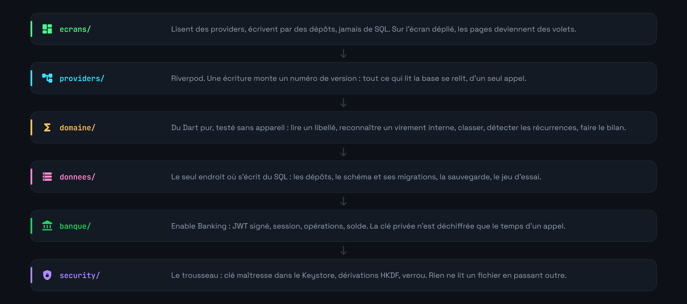

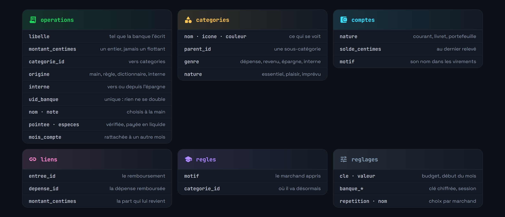

Les montants sont des entiers, en centimes : jamais un flottant ne touche à l'argent. Le domaine ne connaît ni Flutter ni la base, ce qui le rend testable sans appareil.



La clé maîtresse est tirée au hasard au premier lancement et ne quitte jamais le Keystore d'Android. Tout le reste en dérive : la base, et la clé privée d'Enable Banking, la donnée la plus sensible de l'application, puisqu'elle ouvre la lecture du compte. Elle vit chiffrée deux fois, par sa propre clé et dans une base elle-même chiffrée, et n'est déchiffrée que le temps d'une requête. La signature RS256 se fait côté natif, par `java.security`.

**Tout effacer** détruit la clé d'abord, puis la base et ses fichiers annexes : même interrompu, rien de lisible ne reste.

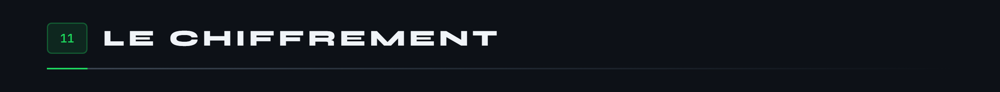

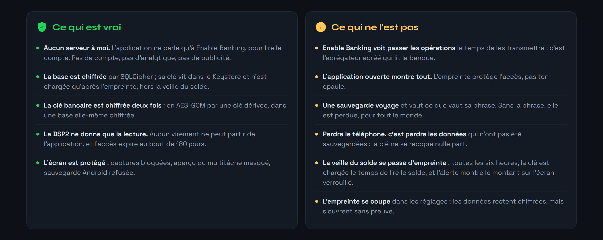

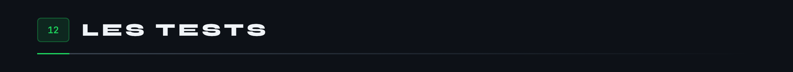

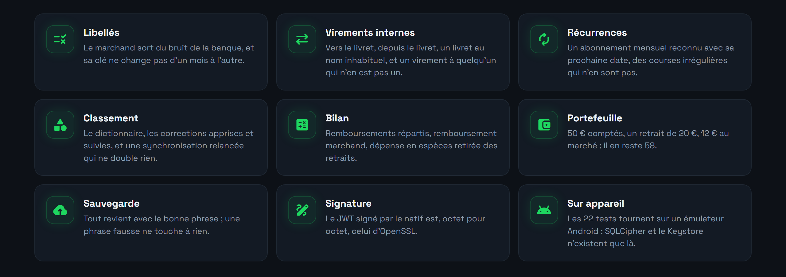

SQLCipher et le Keystore n'existent que sur un appareil : les tests tournent sur un émulateur, jamais sur le téléphone qui porte les vrais comptes, car ils effacent la base.

```
flutter test integration_test -d emulator-5554
```


Le code est publié sous licence [MIT](LICENSE) : libre de le lire, de le reprendre et de le modifier, à condition de garder la mention de copyright. La police Figtree est sous licence SIL Open Font, les icônes Material Symbols sous licence Apache 2.0.

Conçu et écrit par **Tristan Joncour**, élève ingénieur en cyberdéfense à l'ENSIBS, pour tenir ses propres comptes. Le socle de sécurité, empreinte, trousseau et chiffrement, vient de son autre application, [BodyCount](https://github.com/Cybertrist/BodyCount).

**Ce qui ne sera jamais dans ce dépôt :** la clé privée d'Enable Banking, la clé de signature de l'APK, et la moindre donnée bancaire réelle. `.gitignore` refuse les fichiers `.pem`, `.p12`, `.jks` et `key.properties`.

<br>

<sub>Les images de cette page ne sortent d'aucun logiciel de dessin : ce sont des pages HTML que Chrome capture, et cinq SVG animés écrits à la main par <code>anime.js</code>. Les captures viennent d'un émulateur rempli par le jeu d'essai, rognées par <code>rogner.js</code>. Tout est dans <a href="docs/tools/">docs/tools</a>.</sub>
