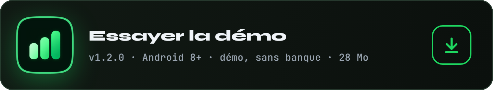
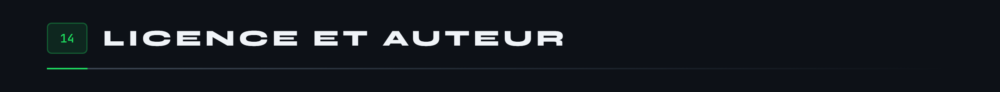

<div align="center">

<p>
  
  <a href="README.en.md"></a>
</p>


</div>

<br>

Une application Android de budget, faite pour une seule personne et un seul compte : le sien. Elle lit le compte courant par la DSP2, range chaque opération dans sa catégorie, met de côté ce qui n'est ni une dépense ni un revenu, et montre où part l'argent, mois après mois. Tout reste sur le téléphone, chiffré.

Elle est née d'une envie simple : arrêter de dépenser sans regarder, et de piocher dans l'épargne. Le modèle, c'est Bankin ; le style, celui de Spotify, sobre et sombre, avec un seul vert.


Sur le téléphone, une capsule flottante en bas pour naviguer.


Sur l'écran déplié du Fold, un rail à gauche, et les pages deviennent des volets côte à côte.


<p align="center">
<a href="https://github.com/Cybertrist/SmartBudget/releases/latest/download/SmartBudget.apk"></a>
<a href="https://github.com/Cybertrist/SmartBudget/releases/latest/download/SmartBudget-demo.apk"></a>
</p>

Deux applications, qui s'installent côte à côte sans se gêner.

- **SmartBudget**, la version complète : elle se relie à ta banque et ne contient que tes vraies opérations.
- **SmartBudget démo** : quatre mois d'opérations inventées, déjà chargées à l'ouverture, sans banque, sans empreinte, et les captures d'écran permises. Pour voir chaque écran avant de relier quoi que ce soit.

Les APK ne sont pas sur le Play Store : Android demande d'autoriser l'installation depuis le navigateur, une fois. Chaque version est signée par la même clé, ce qui permet de l'installer par-dessus la précédente sans rien perdre. Pour vérifier le fichier téléchargé :

```
# SHA-256 de SmartBudget.apk, version 1.2.0
7e4a133a989944b24b058f3d174a1fe7a892df414e8d3e538378804c70b9f1a6

# SHA-256 de SmartBudget-demo.apk, version 1.2.0
a9ffca9d9110dc4398d7cdcde7930f12487f3f367fcea07e5cfa19a23f71022f

# SHA-256 du certificat de signature, CN=SmartBudget, O=Cybertrist
55572db26550312a39ee80315ad81ce6c31e492f0e3aebfc8e5e0f2cffabcbef
```

Pour la construire soi-même :

```
flutter build apk --release --split-per-abi
# la démo, avec son propre identifiant et le jeu d'essai déjà chargé :
flutter build apk --release --split-per-abi --dart-define=DEMO=true
```


La banque ne parle pas aux particuliers : il faut un agrégateur agréé DSP2. [Enable Banking](https://enablebanking.com) en propose un, gratuit en mode restreint, c'est-à-dire limité aux comptes qu'on a soi-même reliés sur son portail. Bridge, l'API de Bankin, est réservé aux entreprises, et GoCardless a fermé ses inscriptions.

**Avant de commencer**, il faut : SmartBudget installé, une adresse e-mail que l'on peut ouvrir sur le téléphone, et de quoi se connecter à sa banque en ligne (identifiant, et la validation habituelle, Safetrans au Crédit Mutuel). Compter une dizaine de minutes, une seule fois : ensuite l'accès tient 180 jours.


### 1. Choisir la banque

Onglet **Réglages**, carte **Ta banque**, bouton **Choisir la banque**. La liste contient toutes les banques qu'Enable Banking sait lire pour un particulier, dans une trentaine de pays d'Europe : d'abord les grandes banques du pays du téléphone, puis toutes les autres de A à Z.

### 2. Chercher la sienne

Taper une partie du nom (`mutuel bretagne`) ou un pays (`belgique`) dans le champ de recherche, puis toucher sa banque. Chaque banque tient sur une ligne, avec son pays : il n'y a rien à déplier. Chacune porte l'icône de son application mobile, rangée dans SmartBudget : aucune image n'est chargée depuis Internet, et celles qui n'ont pas d'application gardent leurs initiales.

Toucher la banque ouvre aussitôt la page **Obtenir ta clé**, qui guide l'étape suivante.

### 3. Obtenir sa clé sur le portail d'Enable Banking

C'est la seule étape hors de l'application. La page **Obtenir ta clé** donne les consignes dans l'ordre, et chaque valeur à coller a son bouton **Copier** : il suffit d'aller et venir entre SmartBudget et le navigateur.


1. **Se connecter.** Toucher **Ouvrir le portail** : la page de connexion s'ouvre dans le navigateur. Taper son adresse e-mail, **Continue**, puis ouvrir le lien reçu par e-mail. Le compte Enable Banking se crée tout seul la première fois.
2. **Créer l'application.** Dans **API applications**, remplir **Add a new application** :
   - **Environment** : `Production`
   - **Private key** : laisser `Generate in the browser`
   - **Application name** : `SmartBudget`
   - **Allowed redirect URLs** : `https://cybertrist.github.io/SmartBudget/` (bouton Copier)
   - **Application description** : la phrase proposée (bouton Copier)
   - **Email for data protection** : sa propre adresse e-mail
   - **Privacy URL** et **Terms URL** : `https://github.com/Cybertrist/SmartBudget` (boutons Copier)
3. **Register.** Le portail télécharge un fichier `.pem` : c'est la clé privée de l'application. **Ne jamais le renommer** : son nom est l'identifiant de l'application, et SmartBudget le lit pour s'en servir.
4. **Relier son compte sur le portail.** Sur la fiche de l'application, toucher **Activate by linking accounts**, choisir le pays, sa banque et le type `personal`, puis **Link**. La page de la banque s'ouvre : on s'y connecte et on valide comme d'habitude. L'application passe en mode restreint, gratuit, limité à ce compte.

### 4. Importer la clé

Revenir dans SmartBudget, en bas de la page **Obtenir ta clé** : **Importer la clé**, et choisir le fichier `.pem` dans les téléchargements. Il est aussitôt chiffré dans le téléphone (AES-GCM, par une clé tirée du Keystore), et la copie de travail est effacée. Le fichier resté dans les téléchargements peut ensuite être supprimé, ou rangé en lieu sûr pour réimporter la clé un jour.

### 5. Relier le compte

La suite s'enchaîne seule : la page de la banque s'ouvre une dernière fois, on valide comme d'habitude, et SmartBudget reprend la main. La carte **Ta banque** affiche alors **Synchronisé**, avec les jours d'accès restants, et les douze derniers mois arrivent.

Ensuite, il n'y a plus rien à faire : SmartBudget se synchronise **à chaque ouverture**, et à chaque retour dans l'application, dès que la dernière synchronisation a plus de dix minutes. Le bouton **Synchroniser** de la carte relance un échange à la main. Les opérations encore en attente à la banque, comme un paiement par carte du jour, apparaissent tout de suite, marquées **En attente**, puis sont remplacées par leur version définitive.

### Si ça coince

- **« Le nom du fichier ne contient pas l'identifiant de l'application »** : le fichier `.pem` a été renommé, par exemple en `cle.pem`. Le télécharger de nouveau depuis la fiche de l'application, sans toucher à son nom.
- **« Ce fichier n'est pas une clé privée »** : le fichier choisi n'est pas le `.pem` du portail. Choisir celui téléchargé à l'étape 3.
- **« Enable Banking refuse la clé »** : la clé importée ne correspond pas à l'application, ou l'application n'est pas en `Production`. Refaire l'étape 3, puis importer la nouvelle clé (bouton **Nouvelle clé** de la carte).
- **« Pas de connexion à Internet. »** : la synchronisation reprendra seule à la prochaine ouverture avec du réseau.
- **« Trop de synchronisations aujourd'hui »** : la banque limite le nombre d'accès par jour. Il suffit d'attendre le lendemain.
- **« L'accès a expiré : reconnecte le compte. »** : les 180 jours sont passés. Toucher **Relier le compte** et valider sur la banque : la clé reste la même, rien d'autre à refaire.
- **Sa banque n'est pas dans la liste** : Enable Banking ne la lit pas encore, ou pas pour les particuliers.

L'accès expire au bout de 180 jours, par la loi, ou plus tôt si la banque n'en accorde pas autant : la carte de la banque prévient quinze jours avant, et un toucher le renouvelle. La DSP2 ne partage que le compte courant, que la banque appelle « CARTE BANCAIRE » : les livrets se saisissent à la main, puis vivent au fil des virements repérés. L'application a été écrite et testée avec le Crédit Mutuel de Bretagne : ailleurs, le classement marche de la même façon, mais les virements vers les livrets peuvent demander d'être marqués à la main la première fois.

### Ce qui se passe derrière


Chaque requête vers Enable Banking porte un jeton signé en RS256 par la clé importée, déchiffrée le temps de l'appel seulement. Le retour de la banque passe par une page de GitHub Pages (`docs/index.html`), qui rend la main à l'application par le lien `smartbudget://banque` ; le jeton d'état, tiré au hasard au départ et vérifié au retour, empêche un lien fabriqué ailleurs de relier un autre compte.


SmartBudget n'envoie qu'une seule sorte de notification : **le compte courant vient de passer en négatif**. Pas de rappel de budget, pas de résumé de la semaine, pas de publicité : rien d'autre ne sonne.

### Ce que tu reçois

Une notification **« Compte courant en négatif »**, avec le montant : « Ton compte courant est à -42,10 € ». Elle est en priorité haute, et le montant se lit aussi sur l'écran verrouillé : c'est voulu, l'alerte doit se voir sans déverrouiller. La toucher ouvre SmartBudget, derrière l'empreinte comme d'habitude.

### Quand elle part



**Une seule alerte par passage sous zéro.** Tant que le compte reste en négatif, les lectures suivantes se taisent : pas une notification toutes les six heures. Dès qu'une lecture trouve le compte à zéro ou au-dessus, l'alerte se réarme, et le prochain passage en négatif préviendra de nouveau.

### Comment elle vérifie


- **Toutes les six heures, même application fermée**, Android réveille une petite tâche de fond (WorkManager), seulement quand il y a du réseau. Android peut la décaler de quelques minutes pour ménager la batterie.
- Elle lit **le solde du compte courant, et lui seul** : pas les opérations. Quatre lectures par jour au plus, la limite que la DSP2 accorde aux accès faits sans toi. Si le solde a déjà été lu il y a moins d'une heure, elle ne redemande rien à la banque.
- **Chaque synchronisation dans l'application** fait la même comparaison : l'alerte peut donc aussi partir juste après une synchro.
- Sans réseau, banque indisponible ou accès expiré, elle ne montre rien et Android réessaie au passage suivant.



**Le prix de l'alerte.** Pour lire le solde, la tâche de fond a besoin de la clé bancaire, donc de la clé maîtresse : elle est chargée sans empreinte, le temps de cette lecture seulement, puis oubliée, et la base refermée. C'est la seule exception à la règle « rien ne s'ouvre sans l'empreinte », et le modèle de confidentialité plus bas la compte parmi ce qui n'est pas protégé.

### L'activer, la couper

- **L'activer** : rien à faire. Dès que le compte est relié, la veille démarre, et Android 13 ou plus récent demande une fois la permission d'envoyer des notifications. Répondre **Autoriser**.
- **La faire taire** : Paramètres d'Android, Applications, Smart Budget, Notifications, puis couper la catégorie **« Compte en négatif »**. La veille continue de lire le solde, mais ne sonne plus.
- **L'arrêter complètement** : **Délier** la banque dans les réglages de SmartBudget. Plus aucune lecture ne se fait en arrière-plan.
- **La démo** n'a pas de banque, donc pas de veille ni de notification.


Un libellé de banque est écrit pour la banque. Le marchand s'en extrait en retirant les préfixes, la carte masquée, les dates, les références et les montants recopiés ; sa clé, ses trois premiers mots sans les suffixes de société, reste la même d'un mois à l'autre. C'est elle qui porte les corrections, les noms choisis et les répétitions : renommer « Spotify P2f9 Stockholm » en « Spotify » renomme toutes ses opérations, y compris les prochaines.

Ce que rien ne reconnaît tombe dans « À classer » et attend dans **À vérifier**, signalé sur l'accueil. Une opération vérifiée se pointe, et porte une coche verte.


Un budget honnête ne compte pas deux fois le même argent.

- **Un virement entre ses comptes** n'est ni une dépense ni un revenu. Au Crédit Mutuel de Bretagne, il s'écrit `VIR VERS <destination> DE <source>` : le sens se lit dans le libellé. Il sort du budget, hachuré, et nourrit « mis de côté » ou « pioché ». Si la détection se trompe, dans un sens ou dans l'autre, la ligne **Mouvement** d'une opération la corrige.
- **Un remboursement** se lie aux dépenses qu'il rembourse, depuis l'une ou depuis l'autre. Elles ne comptent plus que pour leur reste à charge, et lui ne compte pas comme un revenu.
- **Une dépense en espèces** se saisit à la main. Elle se retranche des retraits du mois, et le **portefeuille**, s'il est ouvert, suit ce qui reste en poche.


Un écran de téléphone étiré sur huit pouces ne ressemble plus à rien. Sur le Fold ouvert, les pages forment une seule grande page dont on voit les deux derniers volets : on descend de l'analyse à l'opération sans jamais perdre d'où l'on vient, et le geste retour de Samsung referme le dernier volet. Chaque colonne se resserre au besoin pour tout montrer d'un coup, sans défiler. Les saisies s'ouvrent dans une carte au-dessus du clavier, jamais dans une feuille qui monte du bas.


Les montants sont des entiers, en centimes : jamais un flottant ne touche à l'argent. Le domaine ne connaît ni Flutter ni la base, ce qui le rend testable sans appareil.


La clé maîtresse est tirée au hasard au premier lancement et ne quitte jamais le Keystore d'Android. Tout le reste en dérive : la base, et la clé privée d'Enable Banking, la donnée la plus sensible de l'application, puisqu'elle ouvre la lecture du compte. Elle vit chiffrée deux fois, par sa propre clé et dans une base elle-même chiffrée, et n'est déchiffrée que le temps d'une requête. La signature RS256 se fait en Dart, par pointycastle, et donne octet pour octet celle d'OpenSSL.

**Une exception, assumée : la veille du solde.** Pour lire le solde application fermée, il faut la clé bancaire, donc la clé maîtresse. Toutes les six heures, elle est chargée sans empreinte, le temps d'une seule lecture, puis oubliée. La clé n'a jamais été liée à l'empreinte par Android lui-même, seulement par l'application ; la veille rend cette limite visible au lieu de la taire.

**Tout effacer** détruit la clé d'abord, puis la base et ses fichiers annexes : même interrompu, rien de lisible ne reste.


SQLCipher et le Keystore n'existent que sur un appareil : les tests tournent sur un émulateur, jamais sur le téléphone qui porte les vrais comptes, car ils effacent la base.

```
flutter test integration_test -d emulator-5554
```



Le code est publié sous licence [MIT](LICENSE) : libre de le lire, de le reprendre et de le modifier, à condition de garder la mention de copyright. La police Figtree est sous licence SIL Open Font, les icônes Material Symbols sous licence Apache 2.0.

Conçu et écrit par **Tristan Joncour**, élève ingénieur en cyberdéfense à l'ENSIBS, pour tenir ses propres comptes. Le socle de sécurité, empreinte, trousseau et chiffrement, vient de son autre application, [BodyCount](https://github.com/Cybertrist/BodyCount).

**Ce qui ne sera jamais dans ce dépôt :** la clé privée d'Enable Banking, la clé de signature de l'APK, et la moindre donnée bancaire réelle. `.gitignore` refuse les fichiers `.pem`, `.p12`, `.jks` et `key.properties`.

<br>

<sub>Les images de cette page ne sortent d'aucun logiciel de dessin : ce sont des pages HTML que Chrome capture, et dix SVG animés écrits à la main par <code>anime.js</code>. Les captures viennent d'un émulateur rempli par le jeu d'essai, rognées par <code>rogner.js</code>. Tout est dans <a href="docs/tools/">docs/tools</a>.</sub>
