<div align="center">

<p>
  
  <a href="README.en.md"></a>
</p>

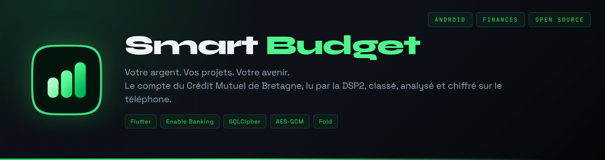

<br>

**Une application Android de budget, faite pour une seule personne et un seul compte : le sien.**

</div>

Elle lit le compte courant par la DSP2, range chaque opération dans sa catégorie, met à part ce qui n'est ni une dépense ni un revenu, et montre où part l'argent, mois après mois. Tout reste sur le téléphone, chiffré : aucun serveur, aucun compte à créer, aucune publicité.

Elle est née d'une envie simple : arrêter de dépenser sans regarder, et de piocher dans l'épargne. Le modèle, c'est Bankin ; le style, celui de Spotify, sobre et sombre, avec un seul vert.

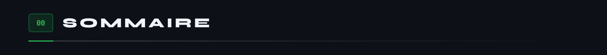

<p align="center">
<a href="#fonctionnalites"></a>
<a href="#ecrans">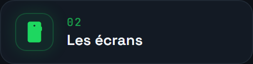</a>
<a href="#installer"></a>
<br>
<a href="#relier"></a>
<a href="#quotidien"></a>
<a href="#lecture">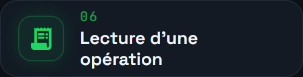</a>
<br>
<a href="#mouvements"></a>
<a href="#alerte"></a>
<a href="#deplie">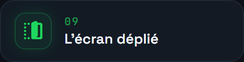</a>
<br>
<a href="#chiffrement"></a>
<a href="#confidentialite"></a>
<a href="#architecture"></a>
<br>
<a href="#tests"></a>
<a href="#versions"></a>
<a href="#licence">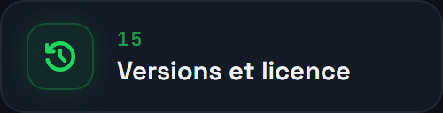</a>
</p>

<a id="fonctionnalites"></a>
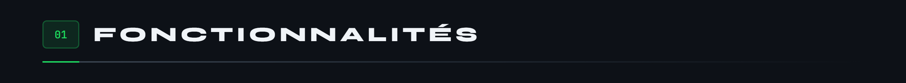


<a id="ecrans"></a>
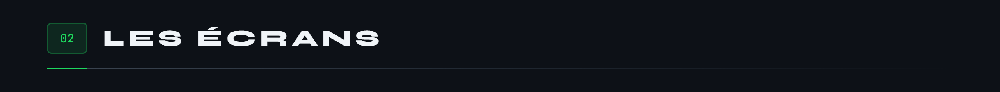

Sur le téléphone, une capsule flottante en bas pour naviguer. Toutes les captures viennent du jeu d'essai de la démo.


Sur l'écran déplié du Fold, un rail à gauche, et les pages deviennent des volets côte à côte.

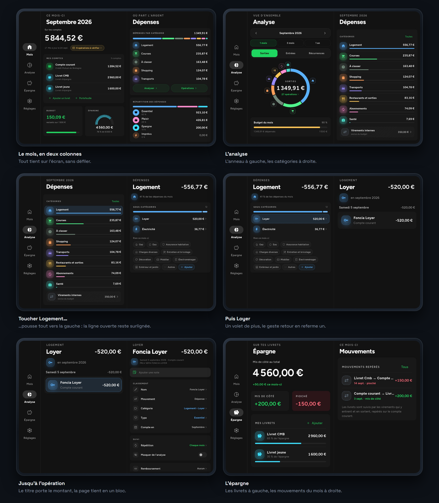

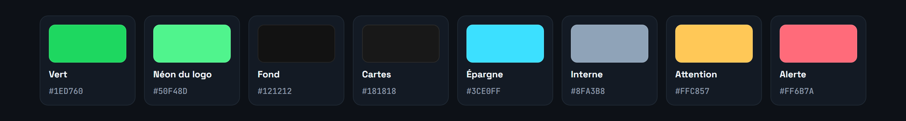

<a id="installer"></a>
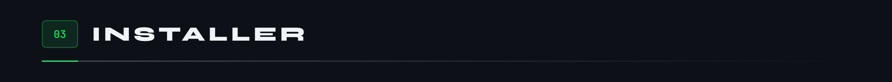

<p align="center">
<a href="https://github.com/Cybertrist/SmartBudget/releases/latest/download/SmartBudget.apk">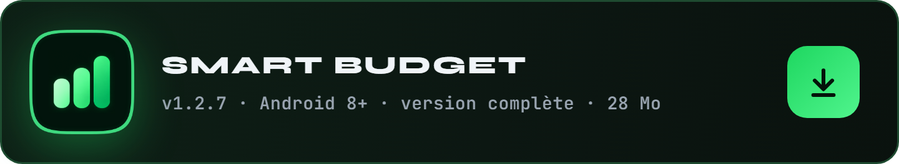</a>
<a href="https://github.com/Cybertrist/SmartBudget/releases/latest/download/SmartBudget-demo.apk">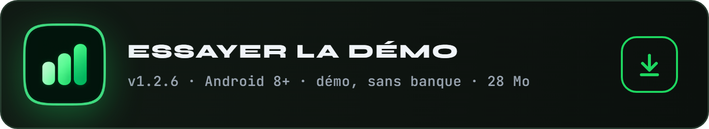</a>
</p>

Deux applications, qui s'installent côte à côte sans se gêner.

- **SmartBudget**, la version complète : elle se relie à ta banque et ne contient que tes vraies opérations.
- **SmartBudget démo** : quatre mois d'opérations inventées, déjà chargées à l'ouverture, sans banque, sans empreinte, et les captures d'écran permises. Pour voir chaque écran avant de relier quoi que ce soit.

Les APK ne sont pas sur le Play Store : Android demande, une fois, d'autoriser l'installation depuis le navigateur. Chaque version est signée par la même clé : elle s'installe par-dessus la précédente sans rien perdre.

<details>
<summary><b>Vérifier le fichier téléchargé, ou construire soi-même</b></summary>

```
# SHA-256 de SmartBudget.apk, version 1.2.6
0b8ba947f2d5a8d697713ee7b3f50cd0497112cc34e05d5f87a1f0b0a4cbb850

# SHA-256 de SmartBudget-demo.apk, version 1.2.6
67a1c7100131d4d9ec81fad7ba9594c92c1c26a093e4c7230cf6cdd23562ad5a

# SHA-256 du certificat de signature, CN=SmartBudget, O=Cybertrist
55572db26550312a39ee80315ad81ce6c31e492f0e3aebfc8e5e0f2cffabcbef
```

```
flutter build apk --release --split-per-abi
# la démo, avec son propre identifiant et le jeu d'essai déjà chargé :
flutter build apk --release --split-per-abi --dart-define=DEMO=true
```

</details>

<a id="relier"></a>
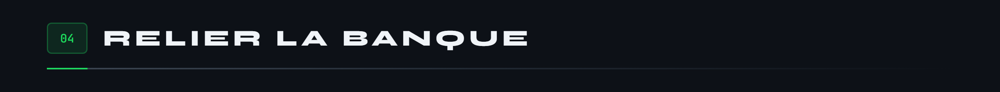

La banque ne parle pas aux particuliers : il faut un agrégateur agréé DSP2. [Enable Banking](https://enablebanking.com) en propose un, gratuit en mode restreint, c'est-à-dire limité aux comptes qu'on a soi-même reliés sur son portail.

**Il faut** SmartBudget installé, une adresse e-mail que l'on peut ouvrir sur le téléphone, et de quoi se connecter à sa banque en ligne. Compter une dizaine de minutes, une seule fois : ensuite, l'accès tient 180 jours.


### 1. Choisir la banque

Onglet **Réglages**, carte **Ta banque**, bouton **Choisir la banque**. La liste contient toutes les banques qu'Enable Banking sait lire pour un particulier, dans une trentaine de pays d'Europe : d'abord les grandes banques du pays du téléphone, puis toutes les autres de A à Z.

### 2. Chercher la sienne

Taper une partie du nom (`mutuel bretagne`) ou un pays (`belgique`), puis toucher sa banque. Chaque banque tient sur une ligne, avec son pays et l'icône de son application mobile, rangée dans SmartBudget : aucune image n'est chargée depuis Internet. La page **Obtenir ta clé** s'ouvre aussitôt.

### 3. Obtenir sa clé sur le portail d'Enable Banking

C'est la seule étape hors de l'application. La page **Obtenir ta clé** donne les consignes dans l'ordre, et chaque valeur à coller a son bouton **Copier** : il suffit d'aller et venir entre SmartBudget et le navigateur.


1. **Se connecter.** Toucher **Ouvrir le portail**, taper son adresse e-mail, **Continue**, puis ouvrir le lien reçu. Le compte Enable Banking se crée tout seul la première fois.
2. **Créer l'application.** Dans **API applications**, remplir **Add a new application** :
   - **Environment** : `Production`
   - **Private key** : laisser `Generate in the browser`
   - **Application name** : `SmartBudget`
   - **Allowed redirect URLs** : `https://cybertrist.github.io/SmartBudget/` (bouton Copier)
   - **Application description** : la phrase proposée (bouton Copier)
   - **Email for data protection** : sa propre adresse e-mail
   - **Privacy URL** et **Terms URL** : `https://github.com/Cybertrist/SmartBudget` (boutons Copier)
3. **Register.** Le portail télécharge un fichier `.pem` : c'est la clé privée de l'application. **Ne jamais le renommer** : son nom est l'identifiant de l'application.
4. **Relier son compte sur le portail.** Sur la fiche de l'application, **Activate by linking accounts**, choisir le pays, sa banque et le type `personal`, puis **Link**, et valider sur la page de la banque comme d'habitude.

### 4. Importer la clé

De retour dans SmartBudget, en bas de la page **Obtenir ta clé** : **Importer la clé**, et choisir le fichier `.pem` dans les téléchargements. Il est aussitôt chiffré dans le téléphone (AES-GCM, par une clé tirée du Keystore), et sa copie de travail effacée.

### 5. Relier le compte

La page de la banque s'ouvre une dernière fois, on valide, et SmartBudget reprend la main. La carte **Ta banque** affiche **Synchronisé**, avec les jours d'accès restants, et les douze derniers mois arrivent. Ensuite, il n'y a plus rien à faire.

L'accès expire au bout de 180 jours, par la loi : à moins de quinze jours de la fin, la carte de la banque passe au jaune, et une fois l'accès expiré, **Relier le compte** le renouvelle, avec la même clé. La DSP2 ne partage que le compte courant, que la banque appelle « CARTE BANCAIRE » : les livrets se saisissent à la main, puis vivent au fil des virements repérés. L'application a été écrite et testée avec le Crédit Mutuel de Bretagne ; ailleurs, le classement marche de la même façon, mais les virements vers les livrets peuvent demander d'être marqués à la main la première fois.

<details>
<summary><b>Si ça coince</b></summary>

- **« Le nom du fichier ne contient pas l'identifiant de l'application »** : le fichier `.pem` a été renommé, par exemple en `cle.pem`. Le télécharger de nouveau depuis la fiche de l'application, sans toucher à son nom.
- **« Ce fichier n'est pas une clé privée »** : le fichier choisi n'est pas le `.pem` du portail. Choisir celui téléchargé à l'étape 3.
- **« Enable Banking refuse la clé »** : la clé importée ne correspond pas à l'application, ou l'application n'est pas en `Production`. Refaire l'étape 3, puis importer la nouvelle clé (bouton **Nouvelle clé** de la carte).
- **« Pas de connexion à Internet. »** : la synchronisation reprendra seule à la prochaine ouverture avec du réseau.
- **« Trop de synchronisations aujourd'hui »** : la banque limite le nombre d'accès par jour. Il suffit d'attendre le lendemain.
- **« L'accès a expiré : reconnecte le compte. »** : les 180 jours sont passés. Toucher **Relier le compte** et valider sur la banque : la clé reste la même.
- **Sa banque n'est pas dans la liste** : Enable Banking ne la lit pas encore, ou pas pour les particuliers.

</details>

<details>
<summary><b>Ce qui se passe derrière</b></summary>


Chaque requête vers Enable Banking porte un jeton signé en RS256 par la clé importée, déchiffrée le temps de l'appel seulement. Le retour de la banque passe par une page de GitHub Pages (`docs/index.html`), qui rend la main à l'application par le lien `smartbudget://banque` ; le jeton d'état, tiré au hasard au départ et vérifié au retour, empêche un lien fabriqué ailleurs de relier un autre compte.

</details>

<a id="quotidien"></a>
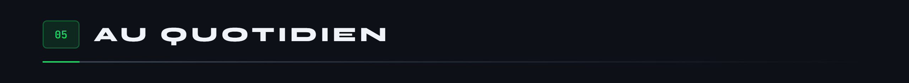

SmartBudget se synchronise **à chaque ouverture**, et à chaque retour dans l'application dès que la dernière synchronisation a plus de dix minutes. Il n'y a rien d'autre à faire que regarder.


Chaque synchronisation redemande les opérations depuis la dernière, moins sept jours, pour rattraper celles que la banque comptabilise en retard. Une opération déjà connue, à son identifiant bancaire, est ignorée : relancer ne double rien. Une opération **En attente**, comme un paiement par carte du jour, apparaît tout de suite ; une fois comptabilisée, elle est mise à jour sur place et garde ce que tu y avais fait à la main (nom, catégorie, note, mois) et ses liens de remboursement.


L'accueil montre toujours le mois en cours. Le budget, c'est ce qui reste une fois les sorties retirées : vert, jaune dès 90 %, rouge au-delà, où il affiche le dépassement. Suivent les cinq catégories les plus lourdes, puis la répartition entre essentiel, plaisir, épargne et imprévu. Un virement vers un livret n'y compte que comme épargne, un remboursement lié allège la dépense qu'il rembourse, et une opération masquée n'apparaît nulle part.


L'analyse part d'un mois et descend jusqu'à l'opération. Les flèches changent de mois, les puces choisissent un mois, trois ou un an, et les onglets passent des sorties aux entrées et aux récurrences. Le centre de l'anneau ouvre les opérations qu'il compte ; une catégorie ouvre ses sous-catégories, une sous-catégorie ses opérations, jour par jour. Au retour, le mois, la période et l'onglet restent ceux qu'on avait choisis.

<a id="lecture"></a>




Un libellé de banque est écrit pour la banque. Le marchand s'en extrait en retirant les préfixes, la carte masquée, les dates, les références et les montants recopiés ; sa clé, ses trois premiers mots sans les suffixes de société, reste la même d'un mois à l'autre. C'est elle qui porte les corrections, les noms choisis et les répétitions : renommer « Spotify P2f9 Stockholm » en « Spotify » renomme toutes ses opérations, y compris les prochaines.


Ce que rien ne reconnaît attend dans **À vérifier**, signalé sur l'accueil. Classer une opération écrit une règle sur la clé du marchand : ses autres opérations qui n'ont pas été classées à la main suivent tout de suite, et les prochaines arriveront déjà classées. Un chèque, une remise de chèque ou un retrait n'ont pas de marchand : les classer ne vaut que pour eux. Classer ou garder pointe l'opération, qui porte alors une coche verte.


Les récurrences se déduisent seules : au moins deux passages d'un même marchand, un montant à 15 % près, et chaque écart dans une fenêtre (une semaine, un mois, un trimestre, un an). La prochaine date en découle, et l'analyse les range en retard (quatre jours de grâce), à venir ou payées. La ligne **Répétition** d'une opération corrige la détection pour tout le marchand : « Aucune » s'il ne revient pas, une fréquence s'il revient sans rythme.

<a id="mouvements"></a>
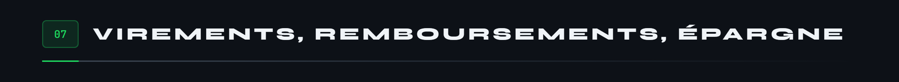


Un budget honnête ne compte pas deux fois le même argent.

- **Un virement entre ses comptes** n'est ni une dépense ni un revenu. Au Crédit Mutuel de Bretagne, il s'écrit `VIR VERS <destination> DE <source>` : le sens se lit dans le libellé. Il sort du budget, hachuré, et nourrit « mis de côté » ou « pioché ». Si la détection se trompe, la ligne **Mouvement** d'une opération la corrige.
- **Un remboursement** se lie aux dépenses qu'il rembourse. Elles ne comptent plus que pour leur reste à charge, et lui ne compte pas comme un revenu.
- **Une dépense en espèces** se saisit à la main. Elle puise dans le plus ancien retrait qui la précède, jusqu'à deux mois avant : retirer 50 € en septembre puis payer 20 € au marché en octobre compte 30 € de retrait en septembre et 20 € de courses en octobre, jamais 70. Le **portefeuille**, s'il est ouvert, suit ce qui reste en poche.


Le remboursement peut arriver avant l'achat ou après. Depuis la dépense, sa ligne **Remboursement** ouvre **Associer à un remboursement**, qui propose l'argent reçu jusqu'à deux mois avant ou après, avec ce qu'il en reste. Depuis l'entrée, **Lier des dépenses** la répartit sur plusieurs dépenses, et la jauge **Réparti** ne dépasse jamais le montant reçu. Une dépense peut être remboursée par plusieurs entrées, jamais au-delà de son montant. Chaque opération reste dans son mois : un achat d'août remboursé en septembre corrige août.


Chaque livret s'ajoute une fois, dans **Épargne**, **Mes livrets**, **Ajouter** : son solde actuel, son type, et le mot qui le désigne sur le relevé. Ensuite, chaque virement vers lui ou depuis lui, repéré sur le compte courant, fait bouger son solde, à condition d'être postérieur au solde saisi et plus en attente. Toucher un livret corrige son solde, tel que la banque l'affiche.


**Le mois budgétaire** s'ouvre avec le salaire : chaque salaire ouvre son mois le jour où il arrive, même versé en avance. Le salaire du 19 décembre, versé plus tôt pour Noël, ouvre janvier ce jour-là, et décembre ne compte jamais deux salaires. Dans les réglages, *Début du mois* affiche le jour habituel, par exemple « Salaire, vers le 25 » : SmartBudget le trouve tout seul, au milieu de tes salaires des six derniers mois, et il ne sert qu'aux mois dont le salaire n'est pas encore arrivé. On peut aussi le choisir à la main, du 1er au 28.

Seul un vrai salaire ouvre un mois : classé dans Salaire, au moins la moitié du salaire habituel, et à dix jours au plus du jour habituel. Une prime ou un remboursement n'ouvrent rien, et deux salaires pour le même mois n'en ouvrent qu'un. Si une opération tombe quand même du mauvais côté, un loyer payé pour le mois suivant par exemple, la ligne **Compte en** de l'opération la rattache au mois d'avant ou d'après.

<a id="alerte"></a>
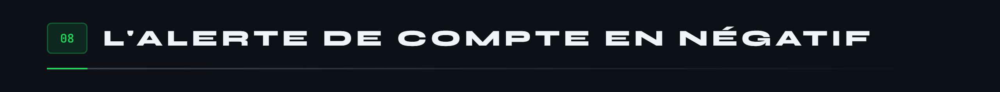

SmartBudget n'envoie qu'une seule notification : **« Compte courant en négatif »**, avec le montant, quand le compte vient de passer sous zéro. Pas de rappel de budget, pas de résumé de la semaine, pas de publicité : rien d'autre ne sonne.


- **Une seule alerte par passage sous zéro.** Tant que le compte reste en négatif, les lectures suivantes se taisent ; dès qu'il remonte, l'alerte se réarme.
- **Toutes les six heures, même application fermée**, Android réveille une petite tâche de fond, seulement quand il y a du réseau. Elle lit **le solde, et lui seul**, quatre fois par jour au plus, la limite que la DSP2 accorde aux accès faits sans toi. Chaque synchronisation dans l'application fait la même comparaison.
- **Le montant se lit sur l'écran verrouillé** : c'est voulu, l'alerte doit se voir sans déverrouiller. La toucher ouvre SmartBudget, derrière l'empreinte.

**Le prix de l'alerte.** Pour lire le solde, la tâche de fond a besoin de la clé bancaire, donc de la clé maîtresse : elle est chargée sans empreinte, le temps de cette lecture, puis oubliée. C'est la seule exception à la règle « rien ne s'ouvre sans l'empreinte », et le modèle de confidentialité la compte parmi ce qui n'est pas protégé.

<details>
<summary><b>L'activer, la faire taire, l'arrêter</b></summary>

- **L'activer** : rien à faire. Dès que le compte est relié, la veille démarre, et Android 13 ou plus récent demande une fois la permission d'envoyer des notifications. Répondre **Autoriser**.
- **La faire taire** : Paramètres d'Android, Applications, Smart Budget, Notifications, puis couper la catégorie **« Compte en négatif »**. La veille continue de lire le solde, mais ne sonne plus.
- **L'arrêter complètement** : **Délier** la banque dans les réglages de SmartBudget. Plus aucune lecture ne se fait en arrière-plan.
- **La démo** n'a pas de banque, donc pas de veille ni de notification.

</details>

<a id="deplie"></a>
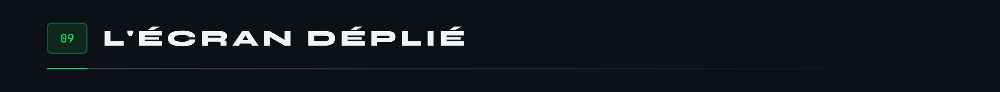


Un écran de téléphone étiré sur huit pouces ne ressemble plus à rien. Sur le Fold ouvert, les pages forment une seule grande page dont on voit les deux derniers volets : on descend de l'analyse à l'opération sans jamais perdre d'où l'on vient, et le geste retour de Samsung referme le dernier volet. Chaque page tient d'un coup, sans défiler ; la fiche d'une opération ouverte seule passe en deux colonnes. Les saisies s'ouvrent dans une carte au-dessus du clavier, jamais dans une feuille qui monte du bas.

<a id="chiffrement"></a>


La clé maîtresse est tirée au hasard au premier lancement et ne quitte jamais le Keystore d'Android. Tout le reste en dérive : la base, et la clé privée d'Enable Banking, la donnée la plus sensible de l'application, puisqu'elle ouvre la lecture du compte. Elle vit chiffrée deux fois, par sa propre clé et dans une base elle-même chiffrée, et n'est déchiffrée que le temps d'une requête. La signature RS256 se fait en Dart, par pointycastle, et donne octet pour octet celle d'OpenSSL. **Tout effacer** détruit la clé d'abord, puis la base : même interrompu, rien de lisible ne reste.


Réglages, Sauvegarde, **Exporter, chiffré** : la phrase se tape deux fois, pour ne pas chiffrer avec une faute de frappe. Le fichier peut voyager n'importe où : sans la phrase, il est illisible. Sur un autre téléphone, **Restaurer une sauvegarde** remplace tout en une seule transaction ; une phrase fausse ne touche à rien. La clé bancaire, chiffrée par la clé maîtresse de l'ancien téléphone, ne s'y relit pas : elle est oubliée, et il suffit de la réimporter pour relier le compte.

<a id="confidentialite"></a>
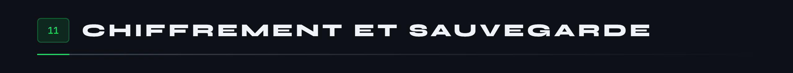


<a id="architecture"></a>
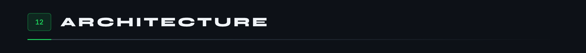


Les montants sont des entiers, en centimes : jamais un flottant ne touche à l'argent. Le domaine ne connaît ni Flutter ni la base, ce qui le rend testable sans appareil.

<a id="tests"></a>
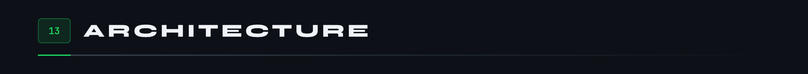


SQLCipher et le Keystore n'existent que sur un appareil : les tests d'intégration tournent sur un émulateur, jamais sur le téléphone qui porte les vrais comptes, car ils effacent la base.

```
flutter test                                   # la logique pure
flutter test integration_test -d emulator-5554 # la base chiffrée, sur un émulateur
```

<a id="versions"></a>
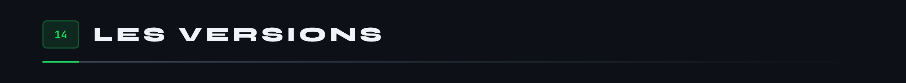


Chaque Release, avec ses notes et ses empreintes SHA-256 : [github.com/Cybertrist/SmartBudget/releases](https://github.com/Cybertrist/SmartBudget/releases).

<a id="licence"></a>


Le code est publié sous licence [MIT](LICENSE) : libre de le lire, de le reprendre et de le modifier, à condition de garder la mention de copyright. La police Figtree est sous licence SIL Open Font, les icônes Material Symbols sous licence Apache 2.0.

Conçu et écrit par **Tristan Joncour**, élève ingénieur en cyberdéfense à l'ENSIBS, pour tenir ses propres comptes. Le socle de sécurité, empreinte, trousseau et chiffrement, vient de son autre application, [BodyCount](https://github.com/Cybertrist/BodyCount).

**Ce qui ne sera jamais dans ce dépôt :** la clé privée d'Enable Banking, la clé de signature de l'APK, et la moindre donnée bancaire réelle. `.gitignore` refuse les fichiers `.pem`, `.p12`, `.jks` et `key.properties`.

<br>

<sub>Les images de cette page ne sortent d'aucun logiciel de dessin : ce sont des pages HTML que Chrome capture, et vingt-trois SVG animés écrits par <code>anime.js</code> et les modules de <code>schemas/</code>. Les captures viennent d'un émulateur rempli par le jeu d'essai, rognées par <code>rogner.js</code>. Tout est dans <a href="docs/tools/">docs/tools</a>.</sub>
